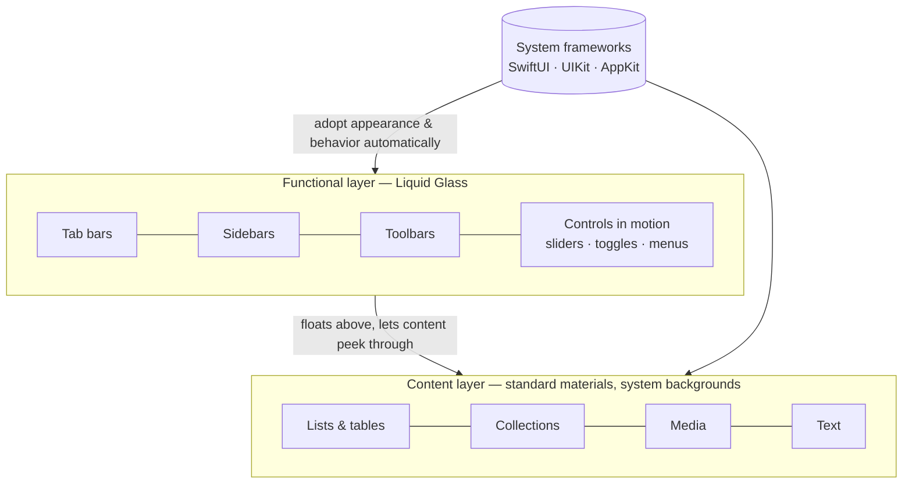
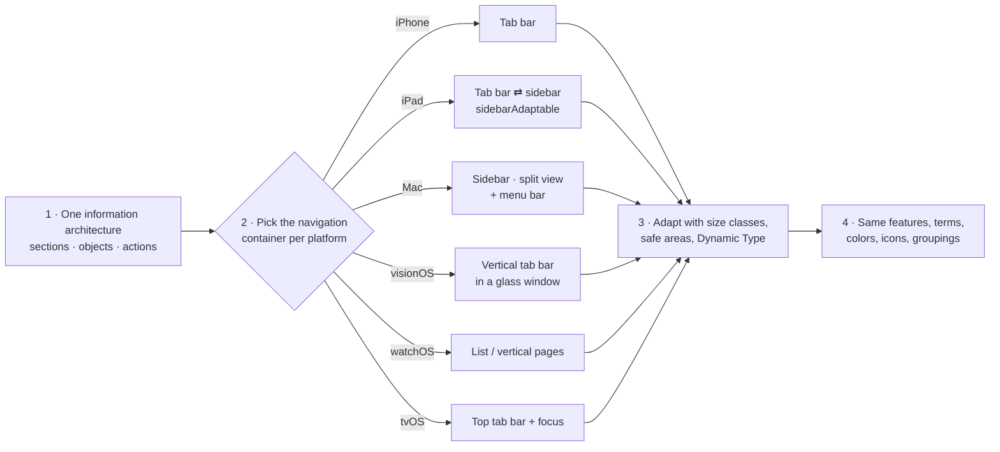

# Apple Design Language — Guidelines

> **Created by Edison Augustin X.**
> The single source of truth for how an AI agent designs apps for the Apple ecosystem —
> iPhone, iPad, iPhone Duo, Mac, Apple TV, Apple Vision Pro, and Apple Watch.

| | |
|---|---|
| **Purpose** | Teach an agent to design apps that feel native and consistent across every Apple platform. |
| **Not the purpose** | Cloning Apple devices, Apple apps, Apple logos, or Apple branding. See [§18 Brand and legal boundaries](#18-brand-and-legal-boundaries). |
| **Primary sources** | [Apple Human Interface Guidelines (HIG)](https://developer.apple.com/design/human-interface-guidelines) · [Apple Developer Documentation](https://developer.apple.com/documentation) |
| **Verified against** | HIG content current through **September 2026** (Liquid Glass, iOS 27 era, iPhone Duo). |
| **Consumed by** | [`rules/`](rules/README.md) (enforceable rules with IDs) · `skills/apple-design-language/` (skill + references) · `AGENTS.md` / `CLAUDE.md` · `hooks/` |

---

## How to read this document

The keywords **MUST**, **MUST NOT**, **SHOULD**, **SHOULD NOT**, and **MAY** follow [RFC 2119](https://www.rfc-editor.org/rfc/rfc2119):

| Keyword | Meaning for an agent |
|---|---|
| **MUST / MUST NOT** | Hard requirement. Apple states it as a rule, a specification, or an App Review consequence. Never violate. |
| **SHOULD / SHOULD NOT** | Strong default. Deviate only with an explicit, stated reason. |
| **MAY** | Optional technique Apple suggests when it fits. |

Every section ends with a **Source** line that links to the Apple page the guidance is derived from. When this document and Apple’s live documentation disagree, **Apple’s documentation wins** — update this file.

> **System values are references, not constants.** Apple states that documented color values “may fluctuate from release to release.” Always use the system API (for example, `Color.blue`, `.body`, `Color(.label)`) instead of hard-coding the values listed here.

---

## Table of contents

0. [The mental model](#0-the-mental-model)
1. [Design principles](#1-design-principles)
2. [Cross-platform design sync](#2-cross-platform-design-sync)
3. [Layout](#3-layout)
4. [Materials and Liquid Glass](#4-materials-and-liquid-glass)
5. [Color](#5-color)
6. [Dark Mode](#6-dark-mode)
7. [Typography](#7-typography)
8. [Iconography: SF Symbols, interface icons, app icons](#8-iconography)
9. [Motion](#9-motion)
10. [Haptics](#10-haptics)
11. [Accessibility](#11-accessibility)
12. [Inclusion and writing](#12-inclusion-and-writing)
13. [Components](#13-components)
14. [Patterns](#14-patterns)
15. [Inputs](#15-inputs)
16. [Platform guides](#16-platform-guides)
17. [Implementation map (SwiftUI · UIKit · AppKit)](#17-implementation-map)
18. [Brand and legal boundaries](#18-brand-and-legal-boundaries)
19. [Agent review checklist](#19-agent-review-checklist)
20. [Sources](#20-sources)

---

## 0. The mental model

Apple interfaces are built from **two layers** and one rule: *use the system first*.

1. **Content layer** — your app’s content, on system backgrounds and *standard materials*. Content is the hero.
2. **Functional layer** — controls and navigation (tab bars, sidebars, toolbars) rendered in **Liquid Glass**, floating above content.
3. **System first** — standard components from SwiftUI, UIKit, and AppKit pick up Liquid Glass, Dark Mode, Dynamic Type, accessibility, right-to-left layout, and platform behavior automatically. Custom UI must re-implement all of that, so an agent **SHOULD** reach for a standard component before building a custom one.

---

## 1. Design principles

Apple’s design principles (reintroduced June 2026) are tools for weighing trade-offs, not a checklist. An agent **SHOULD** name the principle it is applying when it makes a non-obvious design decision.

| Principle | Short form | What it means for an agent |
|---|---|---|
| **Purpose** | Make something meaningful. | Identify the few things that matter most to people and make those great. Don’t re-create existing solutions without a reason. |
| **Agency** | Let people do things their own way. | Get people to their task fast, avoid locking them into flows, make guided flows skippable, and make mistakes recoverable (undo, reversible actions). |
| **Responsibility** | Act in people’s best interest. | Be transparent about what the product does and why; request only the data you need; protect it. |
| **Familiarity** | Build on what people know. | Use established patterns and apply them consistently; give clear feedback using system patterns. |
| **Flexibility** | Adapt to diverse contexts and needs. | Design for everyone (accessibility first), preserve people’s context across configurations, support many input methods, give every platform the same level of care. |
| **Simplicity** | Be clear and direct. | Include just what’s necessary (simplicity isn’t minimalism), be concise, establish a clear hierarchy. |
| **Craft** | Care about every detail. | Deliberate visuals, smooth animation, precise words; prototype, iterate, and keep the app current with platform capabilities. |
| **Delight** | Make it human. | Choose the emotion you want to evoke; create defining moments — but don’t mistake decoration for delight or let it get in the way of the task. |

**Source:** [Design principles](https://developer.apple.com/design/human-interface-guidelines/design-principles)

---

## 2. Cross-platform design sync

“Design sync” means one app, one identity, one information architecture — expressed in the idiom of each platform. Apple’s guidance is explicit: **keep functionality the same as the available space changes, keep the layout recognizable and familiar to the platform, and give each platform you support the same level of care.**

### 2.1 What stays the same everywhere

| Keep identical across platforms | Why | Source |
|---|---|---|
| Features and functionality | “Don’t change your app’s functionality based on the space it occupies.” You MAY change how much is *visible*. | Layout |
| Information hierarchy and terminology | Consistency builds familiarity; build a list of common terms and reuse it. | Writing, Layout |
| Color *meaning* | Avoid using the same color to mean different things. | Color |
| App icon design | A consistent icon across platforms prevents people mistaking your app for multiple apps. | App icons |
| Standard icons for standard actions | Use the same SF Symbols the system uses (Share, Copy, Delete…). | Icons, Menus |
| Toolbar groupings and placement | “Keep consistent groupings and placement across platforms.” | Toolbars |
| Search experience (iPad ↔ Mac) | Keep search as consistent as possible across iPad and Mac. | Search fields |
| Semantic system colors, Dark Mode, Dynamic Type support | Every platform that supports them expects them. | Color, Dark Mode, Typography |

### 2.2 What adapts per platform (SHOULD)

| Concern | iPhone | iPad | Mac | Apple TV | Vision Pro | Apple Watch |
|---|---|---|---|---|---|---|
| **Top-level navigation** | Floating tab bar (bottom) | Tab bar near top, optionally `sidebarAdaptable` | Sidebar + toolbar + menu bar | Tab bar at top | Vertical tab bar on window’s leading side | Vertical pages / list, Digital Crown |
| **Primary input** | Multi-Touch | Touch, keyboard, trackpad, Apple Pencil | Keyboard + pointer | Siri Remote, game controller | Eyes + indirect gestures | Touch, Digital Crown, double tap, Action button |
| **Viewing distance** | ≤ 1–2 ft | ~3 ft | ~1–3 ft | ≥ 8 ft | Content ≥ 1 m for reading | ≤ 1 ft |
| **Default / min text** | 17 / 11 pt | 17 / 11 pt | 13 / 10 pt | 29 / 23 pt | 17 / 12 pt | 16 / 12 pt |
| **Default / min control** | 44×44 / 28×28 pt | 44×44 / 28×28 pt | 28×28 / 20×20 pt | 66×66 / 56×56 pt | 60×60 / 28×28 pt | 44×44 / 28×28 pt |
| **Typical session** | Minutes to an hour+ | Minutes to hours | Minutes to hours | Often hours | Varies | < 1 minute |
| **Commands live in** | Toolbar, menus, context menus | + menu bar (hidden until revealed) | **Menu bar (every command)** | Focusable UI | Toolbar, ornaments, context menus | Toolbar buttons, list |

### 2.3 How an agent designs one app for many platforms

**Sources:** [Layout](https://developer.apple.com/design/human-interface-guidelines/layout) · [Design principles](https://developer.apple.com/design/human-interface-guidelines/design-principles) · [Designing for iOS](https://developer.apple.com/design/human-interface-guidelines/designing-for-ios) · [iPadOS](https://developer.apple.com/design/human-interface-guidelines/designing-for-ipados) · [macOS](https://developer.apple.com/design/human-interface-guidelines/designing-for-macos) · [tvOS](https://developer.apple.com/design/human-interface-guidelines/designing-for-tvos) · [visionOS](https://developer.apple.com/design/human-interface-guidelines/designing-for-visionos) · [watchOS](https://developer.apple.com/design/human-interface-guidelines/designing-for-watchos) · [Typography](https://developer.apple.com/design/human-interface-guidelines/typography) · [Accessibility](https://developer.apple.com/design/human-interface-guidelines/accessibility)

---

## 3. Layout

### 3.1 Visual hierarchy

- **SHOULD** order content by importance in reading order: top to bottom, leading to trailing.
- **SHOULD** align elements to aid scanning and use indentation to express subordination.
- **SHOULD** group related items with negative space, container shapes, or separators.
- **SHOULD** use progressive disclosure (disclosure controls, menus, nested views) instead of showing everything at once.
- **MUST** differentiate controls from content: use Liquid Glass for controls and a **scroll edge effect** — not a solid or semi-opaque background — to lift controls above content.
- **SHOULD** extend full-screen background content beneath sidebars, toolbars, and tab bars; use a **background extension effect** when a sidebar or inspector would otherwise cover important imagery.

### 3.2 Adaptability

An app **MUST** adapt to: compact/regular size classes, screen sizes, orientations and aspect ratios, the Dynamic Island, external displays, Display Zoom, resizable windows (iPad, Mac, iPhone Duo), text-size changes, and locale (LTR/RTL, formatting, text length).

- **MUST** decide layout from **size classes**, not device type or orientation.
- **MUST** consider every combination of horizontal and vertical size class.
- **MUST** respect system-defined **safe areas**, margins, and layout guides.
- **MUST** accommodate larger text: stack horizontally adjacent views, let rows grow, allow multiple lines.
- **SHOULD** test with the largest and smallest layouts first, multiple localizations, and text sizes.
- **SHOULD** scale background artwork to fill (never distort its aspect ratio).
- **MAY** swap a tab bar for a sidebar, or expose overflow items, when space grows.

### 3.3 Platform specifics

| Platform | Rule |
|---|---|
| **macOS** | Avoid controls or critical info at the bottom of a window (people drag windows below the screen edge). Avoid content behind the camera housing. |
| **tvOS** | Inset primary content **60 pt top/bottom and 80 pt left/right**. Pad focusable items so they don’t overlap when they grow on focus. |
| **tvOS grids** | Horizontal spacing **40 pt**, minimum vertical spacing **100 pt**. Unfocused content width: 2-col 860 · 3-col 560 · 4-col 410 · 5-col 320 · 6-col 260 · 7-col 217 · 8-col 184 · 9-col 160 pt. |
| **visionOS** | Support window resizing; keep content centered at large sizes; use 3D in windows sparingly; put supplemental content in an adjacent window, not an ornament; place button centers **≥ 60 pt apart**. |
| **watchOS** | No more than **three glyph buttons or two text buttons** side by side. Support autorotation for content people show others. |
| **iPhone Duo** | See [§16.3](#163-iphone-duo). |

**Source:** [Layout](https://developer.apple.com/design/human-interface-guidelines/layout)

---

## 4. Materials and Liquid Glass

Apple platforms have two material families:

| Material | Layer | Use for |
|---|---|---|
| **Liquid Glass** | Functional layer | Controls and navigation (tab bars, sidebars, toolbars), prominent actions, transient control states. |
| **Standard materials** (ultra-thin, thin, regular, thick) + vibrancy | Content layer | Visual differentiation *within* content, e.g. app backgrounds, overlays. |

### 4.1 Liquid Glass rules

- **MUST NOT** use Liquid Glass in the content layer. *Exception:* transient interactive elements such as slider and toggle knobs take on Liquid Glass while being manipulated.
- **SHOULD** prefer standard components — they adopt Liquid Glass automatically. Apply custom glass effects **sparingly**, only to the most important functional elements.
- **MUST NOT** stack Liquid Glass elements on top of each other or overcrowd them; prefer standard spacing metrics.
- **SHOULD** remove custom backgrounds from bars, split views, sheets, and popovers so the system can render glass and scroll edge effects.
- **Variants:**
  - **Regular** — blurs and adjusts luminosity for legibility. Default for most components and anything text-heavy (alerts, sidebars, popovers).
  - **Clear** — highly translucent; **only** over visually rich backgrounds (photos, video). If the content underneath is bright, add a **dark dimming layer at 35% opacity**; not needed over dark content or AVKit playback controls.
- **MUST** test with the user’s preferred Liquid Glass look, **Reduce Transparency**, **Increase Contrast**, and **Reduce Motion** — these change or remove glass effects.
- **SHOULD** use one scroll edge effect per view (per pane in split views, with consistent heights); prefer the **automatic** style; only use it when scroll content sits behind floating UI — it isn’t decorative.
- **SHOULD** combine multiple custom glass effects in a single `GlassEffectContainer` for rendering performance and fluid morphing.
- **SHOULD** make custom shapes **concentric** with their container (corner radius nested inside the parent’s curvature).

### 4.2 Standard materials

- **SHOULD** choose materials by semantic purpose, not by the color they appear to produce.
- **MUST** use system **vibrant** colors for text, symbols, and fills on materials. Avoid `quaternaryLabel` on thin and ultra-thin materials (too little contrast).
- Thicker materials give better contrast for fine text; thinner materials keep more context visible.

### 4.3 Platform notes

| Platform | Guidance |
|---|---|
| **iOS / iPadOS** | Four standard materials: ultra-thin, thin, regular (default), thick. Vibrancy levels: label, secondary, tertiary, quaternary; fill, secondary, tertiary; one separator. |
| **macOS** | Purpose-specific materials (`NSVisualEffectView.Material`); choose *behind-window* or *within-window* blending. |
| **tvOS** | Liquid Glass in navigation and system experiences; buttons and image views adopt glass on focus. Standard materials: ultraThin (full-screen, light), thin (overlay, light), regular (overlay), thick (overlay, dark). |
| **visionOS** | Windows use the system **glass** material (unmodifiable); there is no separate Dark Mode. Prefer translucency to opaque color. Thin = interactive emphasis; regular = section separation; thick = dark element on regular. |
| **watchOS** | Keep system material backgrounds in full-screen modals; toolbar buttons use Liquid Glass. |

**Sources:** [Materials](https://developer.apple.com/design/human-interface-guidelines/materials) · [Scroll views](https://developer.apple.com/design/human-interface-guidelines/scroll-views) · [Adopting Liquid Glass](https://developer.apple.com/documentation/technologyoverviews/adopting-liquid-glass) · [Applying Liquid Glass to custom views](https://developer.apple.com/documentation/swiftui/applying-liquid-glass-to-custom-views)

---

## 5. Color

### 5.1 Best practices

- **MUST NOT** use the same color to mean different things (for example, an interactive tint on non-interactive text).
- **MUST** make every color work in **light, dark, and increased contrast** contexts. Custom colors need a light and dark variant, each with an increased-contrast option. Supply both even if the app ships in one appearance — Liquid Glass adapts between them.
- **MUST NOT** rely on color alone to convey information, interactivity, or state; add text, shape, or symbol.
- **MUST NOT** hard-code system color values; use the semantic API.
- **MUST NOT** redefine the meaning of dynamic system colors (e.g., separator color as text color).
- **SHOULD** test under varied lighting, on True Tone displays, and across P3 and sRGB.
- **SHOULD** consider cultural meaning of colors in each locale.
- **SHOULD** use system color pickers when people choose colors.

### 5.2 Liquid Glass color

- Liquid Glass has no inherent color; it takes color from content behind it.
- **SHOULD** apply color to glass sparingly — for status or the **primary action** — and tint the **background**, not the symbol or text. The system tints prominent buttons (like **Done**) with the accent color.
- **MUST NOT** tint the backgrounds of multiple controls.
- **SHOULD** prefer monochromatic toolbars and tab bars over colorful content; choose an accent color that’s clearly distinct from content colors.
- **SHOULD** keep the resting state (top of a scroll view) legible even if colorful content scrolls under controls later.

### 5.3 System colors (reference values — use the API)

visionOS uses the default dark values.

| Name | SwiftUI API | Light | Dark | Increased contrast (light) | Increased contrast (dark) |
|---|---|---|---|---|---|
| Red | `red` | `#FF383C` | `#FF4245` | `#E9152D` | `#FF6165` |
| Orange | `orange` | `#FF8D28` | `#FF9230` | `#C55300` | `#FFA056` |
| Yellow | `yellow` | `#FFCC00` | `#FFD600` | `#A16A00` | `#FEDF43` |
| Green | `green` | `#34C759` | `#30D158` | `#008932` | `#4AD968` |
| Mint | `mint` | `#00C8B3` | `#00DAC3` | `#008575` | `#54DFCB` |
| Teal | `teal` | `#00C3D0` | `#00D2E0` | `#008198` | `#3BDDEC` |
| Cyan | `cyan` | `#00C0E8` | `#3CD3FE` | `#007EAE` | `#6DD9FF` |
| Blue | `blue` | `#0088FF` | `#0091FF` | `#1E6EF4` | `#5CB8FF` |
| Indigo | `indigo` | `#6155F5` | `#6D7CFF` | `#564ADE` | `#A7AAFF` |
| Purple | `purple` | `#CB30E0` | `#DB34F2` | `#B02FC2` | `#EA8DFF` |
| Pink | `pink` | `#FF2D55` | `#FF375F` | `#E7124D` | `#FF8AC4` |
| Brown | `brown` | `#AC7F5E` | `#B78A66` | `#956D51` | `#DBA679` |

**iOS / iPadOS system grays** (SwiftUI `gray` = `systemGray`):

| Name | UIKit API | Light | Dark | Increased contrast (light) | Increased contrast (dark) |
|---|---|---|---|---|---|
| Gray | `systemGray` | `#8E8E93` | `#8E8E93` | `#6C6C70` | `#AEAEB2` |
| Gray 2 | `systemGray2` | `#AEAEB2` | `#636366` | `#8E8E93` | `#7C7C80` |
| Gray 3 | `systemGray3` | `#C7C7CC` | `#48484A` | `#AEAEB2` | `#545456` |
| Gray 4 | `systemGray4` | `#D1D1D6` | `#3A3A3C` | `#BCBCC0` | `#444446` |
| Gray 5 | `systemGray5` | `#E5E5EA` | `#2C2C2E` | `#D8D8DC` | `#363638` |
| Gray 6 | `systemGray6` | `#F2F2F7` | `#1C1C1E` | `#EBEBF0` | `#242426` |

### 5.4 Semantic (dynamic) colors

**iOS / iPadOS backgrounds** — two sets, each with three levels (primary = overall view, secondary = groups within it, tertiary = groups within secondary):

| Set | Use when | APIs |
|---|---|---|
| System | Default views | `systemBackground`, `secondarySystemBackground`, `tertiarySystemBackground` |
| Grouped | Grouped table views / forms | `systemGroupedBackground`, `secondarySystemGroupedBackground`, `tertiarySystemGroupedBackground` |

**Foreground (iOS/iPadOS/tvOS/visionOS ↔ macOS):**

| Role | iOS family | macOS |
|---|---|---|
| Primary text | `label` | `labelColor` |
| Secondary text (subheading, supplemental) | `secondaryLabel` | `secondaryLabelColor` |
| Tertiary text (unavailable item) | `tertiaryLabel` | `tertiaryLabelColor` |
| Quaternary text (watermark) | `quaternaryLabel` | `quaternaryLabelColor` |
| Placeholder | `placeholderText` | `placeholderTextColor` |
| Separator (translucent) | `separator` | `separatorColor` |
| Separator (opaque) | `opaqueSeparator` | — |
| Link | `link` | `linkColor` |

macOS adds many control-specific colors (e.g., `controlAccentColor`, `controlBackgroundColor`, `selectedContentBackgroundColor`, `windowBackgroundColor`, `keyboardFocusIndicatorColor`). On macOS 11+, an app **accent color** applies only when the user’s accent setting is *multicolor*; otherwise the user’s choice wins (except fixed-color sidebar icons).

### 5.5 Color management

- **SHOULD** embed color profiles in images; sRGB is accurate on most displays.
- **MAY** use Display P3 (16 bits per channel, PNG) for wide color, and provide sRGB-specific variants in the asset catalog when P3 colors are too close to distinguish on sRGB.

### 5.6 Platform notes

| Platform | Guidance |
|---|---|
| **tvOS** | Limited palette that coordinates with your logo; never indicate focus with color alone — use scale and motion. |
| **visionOS** | Use color sparingly on glass; prefer color in bold text and large areas; balance brightness in immersive experiences. |
| **watchOS** | Use background color to communicate, not decorate; avoid full-screen color in long-running views (workouts, audio); expect tinted complications. |

**Sources:** [Color](https://developer.apple.com/design/human-interface-guidelines/color) · [Labels](https://developer.apple.com/design/human-interface-guidelines/labels)

---

## 6. Dark Mode

- **MUST** look good in light, dark, and **Auto** (switches while the app runs).
- **MUST NOT** offer an app-specific appearance setting — respect the system choice. *Rare exception:* immersive media apps MAY be permanently dark.
- **MUST** use adaptive semantic colors; define custom colors as Color Set assets with light and dark variants.
- **MUST** meet contrast: **at least 4.5:1**; **strive for 7:1** for custom foreground/background pairs, especially small text.
- **SHOULD** test Dark Mode with Increase Contrast and Reduce Transparency, separately and together.
- **SHOULD** slightly darken images with white backgrounds so they don’t glow.
- **SHOULD** use SF Symbols; design separate light/dark interface icons or images only when needed.
- **SHOULD** use system label colors and system text views.
- **iOS/iPadOS:** prefer system backgrounds so the system can switch from *base* to *elevated* colors for popovers, sheets, multitasking, and multiple windows.
- **macOS:** with desktop tinting, custom component backgrounds MAY include some transparency in neutral states only.
- visionOS and watchOS have no Dark Mode setting.

**Source:** [Dark Mode](https://developer.apple.com/design/human-interface-guidelines/dark-mode)

---

## 7. Typography

### 7.1 Legibility

| Platform | Default size | Minimum size |
|---|---|---|
| iOS, iPadOS | 17 pt | 11 pt |
| macOS | 13 pt | 10 pt |
| tvOS | 29 pt | 23 pt |
| visionOS | 17 pt | 12 pt |
| watchOS | 16 pt | 12 pt |

- **MUST NOT** go below the minimum size for the platform (custom or system fonts).
- **SHOULD** avoid Ultralight, Thin, and Light weights; prefer Regular, Medium, Semibold, Bold. Thin custom fonts need larger sizes.
- **SHOULD** minimize the number of typefaces.
- **SHOULD** express hierarchy with weight, size, and color — and keep that hierarchy intact when text size changes.

### 7.2 System fonts

| Family | Notes |
|---|---|
| **San Francisco (SF)** | SF Pro (iOS, iPadOS, macOS, tvOS, visionOS), **SF Compact** (watchOS; **SF Compact Rounded** in complications), SF Mono, plus SF Arabic, Armenian, Georgian, Hebrew. Rounded variants available. Weights Ultralight→Black; widths incl. Condensed, Expanded. |
| **New York (NY)** | Serif family that pairs with SF. Available in iOS, iPadOS, tvOS, watchOS, visionOS (specify styles), and Mac Catalyst. |

- System fonts are variable with **dynamic optical sizes** — no manual Text/Display switching needed.
- **MUST NOT** embed system fonts in an app; access them via `Font.Design` (`.default`, `.serif`, `.rounded`, `.monospaced`).
- **MUST** use built-in **text styles** so text supports **Dynamic Type** and larger accessibility sizes. Use symbolic traits (bold, leading) to adjust; avoid tight leading for 3+ lines.

### 7.3 Text style specifications

**iOS / iPadOS — Large (default) Dynamic Type size**

| Style | Weight | Size (pt) | Leading (pt) | Emphasized |
|---|---|---|---|---|
| Large Title | Regular | 34 | 41 | Bold |
| Title 1 | Regular | 28 | 34 | Bold |
| Title 2 | Regular | 22 | 28 | Bold |
| Title 3 | Regular | 20 | 25 | Semibold |
| Headline | Semibold | 17 | 22 | Semibold |
| Body | Regular | 17 | 22 | Semibold |
| Callout | Regular | 16 | 21 | Semibold |
| Subhead | Regular | 15 | 20 | Semibold |
| Footnote | Regular | 13 | 18 | Semibold |
| Caption 1 | Regular | 12 | 16 | Semibold |
| Caption 2 | Regular | 11 | 13 | Semibold |

iOS Dynamic Type spans **xSmall, Small, Medium, Large (default), xLarge, xxLarge, xxxLarge** and accessibility sizes **AX1–AX5** (Body grows from 14 pt at xSmall to 53 pt at AX5). Full tables live in `skills/apple-design-language/references/`.

**macOS built-in text styles** (macOS doesn’t support Dynamic Type)

| Style | Weight | Size | Line height | Emphasized |
|---|---|---|---|---|
| Large Title | Regular | 26 | 32 | Bold |
| Title 1 | Regular | 22 | 26 | Bold |
| Title 2 | Regular | 17 | 22 | Bold |
| Title 3 | Regular | 15 | 20 | Semibold |
| Headline | Bold | 13 | 16 | Heavy |
| Body | Regular | 13 | 16 | Semibold |
| Callout | Regular | 12 | 15 | Semibold |
| Subheadline | Regular | 11 | 14 | Semibold |
| Footnote | Regular | 10 | 13 | Semibold |
| Caption 1 | Regular | 10 | 13 | Medium |
| Caption 2 | Medium | 10 | 13 | Semibold |

**tvOS built-in text styles**

| Style | Weight | Size | Leading | Emphasized |
|---|---|---|---|---|
| Title 1 | Medium | 76 | 96 | Bold |
| Title 2 | Medium | 57 | 66 | Bold |
| Title 3 | Medium | 48 | 56 | Bold |
| Headline | Medium | 38 | 46 | Bold |
| Subtitle 1 | Regular | 38 | 46 | Medium |
| Callout | Medium | 31 | 38 | Bold |
| Body | Medium | 29 | 36 | Bold |
| Caption 1 | Medium | 25 | 32 | Bold |
| Caption 2 | Medium | 23 | 30 | Bold |

**watchOS — Large (default for 40/41/42 mm)**

| Style | Weight | Size | Leading | Emphasized |
|---|---|---|---|---|
| Large Title | Regular | 36 | 38.5 | Bold |
| Title 1 | Regular | 34 | 36.5 | Semibold |
| Title 2 | Regular | 28 | 30.5 | Semibold |
| Title 3 | Regular | 19 | 21.5 | Semibold |
| Headline | Semibold | 16 | 18.5 | Semibold |
| Body | Regular | 16 | 18.5 | Semibold |
| Caption 1 | Regular | 15 | 17.5 | Semibold |
| Caption 2 | Regular | 14 | 16.5 | Semibold |
| Footnote 1 | Regular | 13 | 15.5 | Semibold |
| Footnote 2 | Regular | 12 | 14.5 | Semibold |

**visionOS** uses bolder Body and Title styles and adds **Extra Large Title 1** and **Extra Large Title 2** for editorial layouts.

### 7.4 Dynamic Type behavior

- **MUST** adapt layout to every text size; verify with Larger Accessibility Text Sizes enabled.
- **SHOULD** scale meaningful icons with text (SF Symbols do this automatically).
- **SHOULD** minimize truncation — show as much useful text at the largest accessibility size as at the largest standard size; don’t truncate in scrollable regions without a way to read the rest.
- **SHOULD** switch to stacked layouts and fewer columns at large sizes (`isAccessibilityCategory`).
- **SHOULD** keep primary elements near the top at every size.
- **SHOULD** prioritize what grows: content people care about, not tab titles or transient values.

### 7.5 Custom fonts

- **MUST** be legible at recommended sizes and **MUST** implement Dynamic Type and Bold Text support.
- **SHOULD** limit custom fonts to headlines/subheadings and use system fonts for body and captions (Branding).

### 7.6 visionOS text

Prefer 2D text; keep it legible when scaled; maximize contrast (white text by default on glass); make free-floating text bold rather than shadowed; **billboard** labels anchored to 3D objects so they face the viewer.

**Sources:** [Typography](https://developer.apple.com/design/human-interface-guidelines/typography) · [Branding](https://developer.apple.com/design/human-interface-guidelines/branding)

---

## 8. Iconography

### 8.1 SF Symbols

- **SHOULD** use SF Symbols for interface icons wherever they exist — they align with SF text in all weights and sizes, adapt to Dark Mode, Dynamic Type, and RTL, and include localized variants.
- **Rendering modes:** *monochrome* (one color), *hierarchical* (one color, varied opacity by layer), *palette* (one color per layer), *multicolor* (intrinsic meaning colors). Verify the chosen mode is legible in every context.
- **Gradients** (SF Symbols 7+): smooth linear gradient from one color; best at large sizes.
- **Variable color** communicates *change* (level, strength, progress) — **MUST NOT** be used to convey depth (use hierarchical).
- **Weights and scales:** nine weights matching SF; three scales (small, medium default, large). **SHOULD** match symbol weight to adjacent text.
- **Variants:** outline (toolbars, lists, next to text), **fill** (iOS tab bars, swipe actions, selection), slash (unavailable), enclosed (legibility at small sizes). Many containers choose the variant automatically.
- **Animations:** Appear, Disappear, Bounce, Scale, Pulse, Variable Color, Replace (down-up, up-up, off-up), **Magic Replace** (default), Wiggle, Breathe, Rotate, **Draw On / Draw Off** (SF Symbols 7+). **SHOULD** apply judiciously, with clear purpose and matching the app’s tone.
- **Custom symbols:** start from an exported template; match detail, weight, alignment, perspective; annotate layers; test every animation preset; use the component library for badges/enclosures; add negative side margins when needed; **MUST** provide accessibility labels.
- **MUST NOT** use SF Symbols (or confusingly similar images) in app icons, logos, or any trademarked use. **MUST NOT** customize symbols that depict Apple products or features.

### 8.2 Interface icons (glyphs)

- **SHOULD** be simple, recognizable, and use familiar metaphors.
- **MUST** keep size, detail, stroke weight, and perspective consistent across all interface icons.
- **SHOULD** optically center asymmetric icons (bake padding into the asset).
- **SHOULD NOT** provide selected-state versions for standard bars and buttons — the system handles it.
- **SHOULD** use inclusive, gender-neutral figures; localize any characters; flip text-like icons for RTL.
- **MUST** ship custom icons as vector PDF/SVG (or custom SF Symbols) and **MUST** give them accessibility labels.
- **MUST NOT** depict Apple hardware except via Apple Design Resources or SF Symbols product glyphs.

**Standard icons for common actions** (use these SF Symbols):

| Action | Symbol | Action | Symbol |
|---|---|---|---|
| Cut | `scissors` | Share | `square.and.arrow.up` |
| Copy | `document.on.document` | Print | `printer` |
| Paste | `document.on.clipboard` | Search | `magnifyingglass` |
| Done | `checkmark` | Find | `text.page.badge.magnifyingglass` |
| Cancel | `xmark` | Filter | `line.3.horizontal.decrease` |
| Delete | `trash` | Account | `person.crop.circle` |
| Undo | `arrow.uturn.backward` | Like / Dislike | `hand.thumbsup` / `hand.thumbsdown` |
| Redo | `arrow.uturn.forward` | Select | `checkmark.circle` |
| Compose | `square.and.pencil` | Bold / Italic / Underline | `bold` / `italic` / `underline` |
| Duplicate | `plus.square.on.square` | Align left / center / right / justify | `text.alignleft` / `text.aligncenter` / `text.alignright` / `text.justify` |
| Rename | `pencil` | Alarm | `alarm` |
| Move to | `folder` | Archive | `archivebox` |
| Attach | `paperclip` | Calendar | `calendar` |
| Add | `plus` | Bring to front / Send to back | `square.3.layers.3d.top.filled` / `square.3.layers.3d.bottom.filled` |
| More | `ellipsis` | Bring forward / Send backward | `square.2.layers.3d.top.filled` / `square.2.layers.3d.bottom.filled` |

### 8.3 App icons

- **Layered** design: a background layer + one or more foreground layers. iOS, iPadOS, macOS, and watchOS icons take on Liquid Glass (specular highlights, refraction, translucency). Compose them in **Icon Composer**. tvOS uses 2–5 layers (parallax); visionOS uses a background + 1–2 layers (3D).
- **MUST** provide unmasked, correctly shaped layers — the system masks them. Square for iOS/iPadOS/macOS (rounded rectangle), square for visionOS/watchOS (circle), rectangle for tvOS.
- **SHOULD** keep primary content centered; prefer crisp foreground edges, vector layers (SVG/PDF), and simple backgrounds (solid or gradient).
- **SHOULD** embrace simplicity; overlapping filled shapes; illustrations over photos; no replicated UI or screenshots; avoid very thin lines.
- **SHOULD** include text only when essential; never “Watch”, “Play”, “New”, or “For visionOS”.
- **MUST NOT** use replicas of Apple hardware.
- **SHOULD NOT** bake in highlights, shadows, bevels, blurs, or glows — the system applies dynamic effects. If you add custom effects, use them intentionally and test them in Icon Composer and on device.
- **SHOULD** keep the icon visually consistent across platforms, and **MUST** keep its core features consistent across appearances (**default, dark, clear light/dark, tinted light/dark** on iOS, iPadOS, macOS). Base the dark icon on the light one.
- **watchOS:** avoid a black background. **visionOS:** avoid “hole” shapes in the background. **tvOS:** keep a safe zone.
- Alternate icons (iOS, iPadOS, tvOS, visionOS-compatible) need their own dark, clear, and tinted variants and are subject to App Review.

| Platform | Layout shape | After masking | Layout size | Style | Appearances |
|---|---|---|---|---|---|
| iOS, iPadOS, macOS | Square | Rounded rectangle | 1024×1024 px | Layered | Default, dark, clear light, clear dark, tinted light, tinted dark |
| tvOS | Rectangle (landscape) | Rounded rectangle | 800×480 px | Layered (parallax) | — |
| visionOS | Square | Circular | 1024×1024 px | Layered (3D) | — |
| watchOS | Square | Circular | 1088×1088 px | Layered | — |

Color spaces: sRGB, Gray Gamma 2.2, Display P3 (not visionOS).

### 8.4 Images

| Platform | Scale factors |
|---|---|
| iOS | @2x and @3x |
| iPadOS, watchOS | @2x |
| macOS, tvOS | @1x and @2x |
| visionOS | @2x or higher (prefer vector) |

Formats: de-interlaced PNG for bitmaps; 8-bit palette PNG when full color isn’t needed; JPEG/HEIC for photos; stereo HEIC for spatial photos; PDF/SVG for flat artwork. Include color profiles; test on real devices.

**Sources:** [SF Symbols](https://developer.apple.com/design/human-interface-guidelines/sf-symbols) · [Icons](https://developer.apple.com/design/human-interface-guidelines/icons) · [App icons](https://developer.apple.com/design/human-interface-guidelines/app-icons) · [Images](https://developer.apple.com/design/human-interface-guidelines/images)

---

## 9. Motion

- **SHOULD** add motion only with purpose; never gratuitous.
- **MUST** make motion optional — never the only channel for important information; pair with haptics or audio.
- **SHOULD** make feedback motion realistic and gesture-following (dismiss the way it was revealed).
- **SHOULD** keep feedback animation brief and precise.
- **SHOULD NOT** add motion to frequent UI interactions in apps — system components already animate subtly.
- **MUST** let people cancel or interrupt motion; never force them to wait.
- **MAY** use SF Symbol animations.
- Liquid Glass motion is emphasized for direct touch and subdued for trackpad — standard components do this automatically.
- **Reduce Motion** — when on, reduce automatic and repetitive animation (zoom, scale, peripheral motion): tighten springs, track gestures directly, avoid z-axis depth animation, replace x/y/z transitions with fades, avoid animating into or out of blurs.
- **visionOS:** avoid motion at the edges of the field of view; make large moving objects more translucent or lower contrast; fade to relocate objects; don’t rotate the virtual world; provide a stationary frame of reference; avoid sustained oscillation, especially around **0.2 Hz**.
- **watchOS:** layout and appearance animations include built-in easing that can’t be customized.
- **Games:** target a consistent 30–60 fps.

**Sources:** [Motion](https://developer.apple.com/design/human-interface-guidelines/motion) · [Accessibility](https://developer.apple.com/design/human-interface-guidelines/accessibility)

---

## 10. Haptics

- **MUST** use system haptic patterns only for their documented meanings.
- **SHOULD** use haptics consistently (clear cause and effect), complement visuals and sound (match intensity and sharpness), avoid overuse, prefer short haptics for discrete events, and let people turn them off.
- **SHOULD NOT** let haptics disrupt camera, gyroscope, or microphone use.
- **iOS feedback generators:** *notification* (task outcome), *impact* (physical metaphor, e.g. snapping into place), *selection* (values changing). Standard toggles, sliders, and pickers play haptics automatically.
- **macOS (Force Touch trackpad):** alignment, level change, generic.
- **watchOS:** notification, up, down, success, failure, retry, start, stop, click; Digital Crown detents.
- **visionOS:** no haptics — rely on standard controls’ audible feedback.
- **Custom haptics (Core Haptics):** transient and continuous events, with sharpness and intensity.

**Source:** [Playing haptics](https://developer.apple.com/design/human-interface-guidelines/playing-haptics)

---

## 11. Accessibility

Accessible interfaces are **intuitive, perceivable, and adaptable**. Audit with Accessibility Inspector; declare support with Accessibility Nutrition Labels on the App Store.

### 11.1 Vision

- **SHOULD** let people enlarge text by **at least 200%** (140% on watchOS), ideally by adopting Dynamic Type.
- **MUST** meet contrast minimums (WCAG AA, as used by Accessibility Inspector):

| Text size | Weight | Minimum contrast |
|---|---|---|
| Up to 17 pt | All | 4.5:1 |
| 18 pt and larger | All | 3:1 |
| All | Bold | 3:1 |

  If defaults can’t meet this, **MUST** provide a higher-contrast scheme when **Increase Contrast** is on. Check both appearances.
- **SHOULD** prefer system colors (they have accessible variants).
- **MUST** convey information with more than color (watch for red-green and blue-orange pairings).
- **MUST** describe interface and content for **VoiceOver**.

### 11.2 Hearing

- **SHOULD** provide captions, subtitles, audio descriptions, or transcripts as appropriate.
- **SHOULD** pair audio cues with haptics and with visual cues.

### 11.3 Mobility

| Platform | Default control size | Minimum control size |
|---|---|---|
| iOS, iPadOS | 44×44 pt | 28×28 pt |
| macOS | 28×28 pt | 20×20 pt |
| tvOS | 66×66 pt | 56×56 pt |
| visionOS | 60×60 pt | 28×28 pt |
| watchOS | 44×44 pt | 28×28 pt |

- **SHOULD** add about **12 pt** padding around bezeled elements and about **24 pt** around non-bezeled elements’ visible edges.
- **SHOULD** use the simplest gesture for frequent actions; **MUST** offer on-screen alternatives to gestures (e.g., a button as well as swipe-to-dismiss).
- **SHOULD** support Voice Control (label elements), Siri and Shortcuts, AssistiveTouch, Full Keyboard Access, Pointer Control, and Switch Control.

### 11.4 Speech

- **SHOULD** let people navigate and interact using the keyboard alone (Full Keyboard Access); **MUST NOT** override system-defined keyboard shortcuts.
- **SHOULD** support Switch Control.

### 11.5 Cognitive

- **SHOULD** keep actions simple, familiar, and consistent.
- **SHOULD** avoid auto-dismissing (timed) UI; prefer explicit dismissal.
- **MUST** let people control audio and video playback; avoid autoplay without controls; respect **Dim Flashing Lights**.
- **MUST** respect **Reduce Motion** (see §9).
- **SHOULD** optimize for **Assistive Access**: core features only, one interaction per screen, double confirmation for hard-to-undo actions.
- **Games:** offer difficulty accommodations.

### 11.6 VoiceOver

- **MUST** provide labels for all key elements (descriptive, kept up to date); describe meaningful images; make charts accessible; hide purely decorative images.
- **SHOULD** use unique screen titles and accurate headings; group, order, and link elements; announce content and layout changes; support the rotor.
- **visionOS:** custom gestures don’t receive hand input while VoiceOver is on (unless Direct Gesture mode).

### 11.7 visionOS comfort

Keep UI in the field of view (prefer horizontal layouts), reduce the speed and intensity of animation (especially peripheral), be gentle with camera motion, don’t head-anchor content, and minimize large repetitive gestures.

**Sources:** [Accessibility](https://developer.apple.com/design/human-interface-guidelines/accessibility) · [VoiceOver](https://developer.apple.com/design/human-interface-guidelines/voiceover)

---

## 12. Inclusion and writing

### 12.1 Voice and tone

- **SHOULD** define the app’s voice and a glossary of terms; vary tone by context (serious for errors, celebratory for achievements).
- **SHOULD** be clear: fewer, plain words; no jargon or undefined technical terms; no colloquialisms; consider humor carefully.
- **SHOULD** address people as *you*; avoid *the user*; avoid *we* (unclear who “we” is — “Unable to load content” beats “We’re having trouble…”).
- **SHOULD** use possessives (*my*, *your*) sparingly and consistently.
- **SHOULD** avoid unnecessary gender references; use gender-neutral figures; offer inclusive options (nonbinary, self-identify, decline to state) if gender is required.
- **SHOULD** portray diverse people and avoid stereotypes; write about disability people-first.

### 12.2 Labels and capitalization

- **SHOULD** label buttons with verbs (“Send”, “Add to Cart”); avoid cute labels; avoid “Click here” — use descriptive link text.
- **MUST** use the right gesture word for the device (**tap** on touch devices, **click** with a pointer) — or device-neutral **choose** in alerts.
- **SHOULD** choose a capitalization style per element type and apply it consistently. Apple’s own conventions:
  - **Title-style**: buttons, menu items, menu titles, segment labels, column headings, alert titles that are fragments, list/form **section headers** (no longer all caps).
  - **Sentence-style**: alert titles that are complete sentences, alert messages, purpose strings, slider labels (ending in a colon).
- **SHOULD** use consistent multistep language: “Get Started” → “Continue”/“Next” → “Done”.
- **SHOULD** append an ellipsis (…) to commands that need more input before completing (menu items, macOS push buttons that open another view).
- **SHOULD** remove articles (*a*, *an*, *the*) from menu items.

### 12.3 Errors, empty states, settings, fields

- **SHOULD** write errors that are close to the problem, blame-free, and actionable (“Choose a password with at least 8 characters”); no “Oops!”; no robotic messages like “Invalid name”.
- **SHOULD** give empty states a clear next step and a button to take it; never place crucial information there.
- **SHOULD** label settings plainly and describe what happens when *on*; link directly to settings rather than describing their location.
- **SHOULD** label every text field and use placeholder hints (“name@example.com”); show errors next to the field.

### 12.4 Languages and right-to-left

- **SHOULD** internationalize and localize; let the system format dates, times, numbers, and currency.
- System components flip automatically for RTL. Additionally:
  - Align 1–2 line text to the interface direction, but align **paragraphs** (3+ lines) to their language; align all list items consistently.
  - **MUST NOT** reverse the digits within a number; reverse the order of numerals that show progress or sequence.
  - Flip progress controls, sliders, back/forward navigation, and icons depicting text or forward motion.
  - **MUST NOT** flip photos, logos, universal marks (e.g., checkmark), or real-world objects (e.g., clocks); keep controls that refer to an actual direction.
  - When mixing Arabic/Hebrew with uppercase Latin, increase the RTL font size by about **2 pt**.

**Sources:** [Writing](https://developer.apple.com/design/human-interface-guidelines/writing) · [Inclusion](https://developer.apple.com/design/human-interface-guidelines/inclusion) · [Right to left](https://developer.apple.com/design/human-interface-guidelines/right-to-left) · [Menus](https://developer.apple.com/design/human-interface-guidelines/menus) · [Alerts](https://developer.apple.com/design/human-interface-guidelines/alerts) · [Adopting Liquid Glass](https://developer.apple.com/documentation/technologyoverviews/adopting-liquid-glass)

---

## 13. Components

> Rule of thumb: **standard component first, customize second, build custom last.** When customizing, preserve sizing, placement, and behavior (Branding).

### 13.1 Buttons

- **MUST** give every button a hit region of **at least 44×44 pt (60×60 pt in visionOS)**, with space around it.
- **MUST** give custom buttons a **press state**.
- **SHOULD** use a prominent style for the most likely action; **no more than one or two prominent buttons per view**.
- **SHOULD** distinguish the preferred option by **style, not size**.
- **SHOULD** use familiar symbols for familiar actions; short verb-first title-case text when clearer than an icon.
- **Roles:** normal, **primary** (accent color, responds to Return, can close temporary views), **cancel**, **destructive** (system red). **MUST NOT** give the primary role to a destructive action.
- **iOS:** MAY show an activity indicator inside a button with an updated label (“Checking out…”).
- **macOS:** push buttons (ellipsis if they open another view), square buttons in views only, one help button per window, image buttons with ~10 px padding.
- **visionOS:** circle (icon), capsule/rounded rectangle (text), capsule (icon + text); sizes Mini 28, Small 32, Regular 44, Large 52, XL 64 pt; centers ≥ 60 pt apart; thin material on glass windows, glass material when floating; never white-fill + black content (reserved for toggled state).
- **watchOS:** capsule inline buttons; full-width primary buttons; toolbar for corner buttons; equal heights in stacks.

### 13.2 Toolbars (incl. navigation bars)

- **SHOULD** avoid overcrowding; define overflow; add a More menu only when needed (system adds overflow on iPadOS/macOS automatically — don’t add one manually).
- **SHOULD** reduce custom toolbar backgrounds and tinted controls; use the content layer and scroll edge effect.
- **MUST** use standard **Back** and **Close** buttons (symbols, not the words “Back”/“Close”).
- **SHOULD** give each window a useful title, **under 15 characters**, and **never the app name**.
- **SHOULD** prefer borderless system symbols; text only for actions poorly represented by symbols (e.g., Edit).
- **MUST** use at most **one** `.prominent` primary action (e.g., Done), placed on the **trailing** side.
- Groupings: **leading** (back, sidebar toggle, title, document menu — not customizable), **center** (common controls, customizable, collapses to overflow), **trailing** (always visible items, inspectors, search, More, primary action). Aim for **≤ 3 groups**; separate text-labeled buttons with fixed space; don’t mix text and icons in one group.
- **MUST** provide an accessibility label for every toolbar icon.
- **iOS:** large titles that collapse on scroll. **iPadOS:** toolbar and tab bar can share the top row. **macOS:** every toolbar item **MUST** also exist in the menu bar. **visionOS:** toolbar at the window’s bottom edge, no vertical toolbars, no pull-down menus in toolbars, prevent windows narrower than the toolbar. **watchOS:** corner or bottom toolbar buttons; scrolling toolbar button for important secondary actions.

### 13.3 Tab bars

- **MUST** use tab bars for **navigation, never actions** (use a toolbar for actions).
- **MUST** keep the tab bar visible across sections (modals may cover it).
- **MUST NOT** disable or hide tabs; explain empty sections instead.
- **SHOULD** keep tabs few; avoid the **More** overflow tab; include single-word labels; use filled SF Symbols; reserve badges for critical information.
- **iOS:** floating Liquid Glass tab bar at the bottom; MAY minimize on scroll with an accessory (`tabBarMinimizeBehavior`); MAY include a dedicated **search tab** at the trailing end (`Tab(role: .search)`).
- **iPadOS:** near the top; fixed or convertible to a sidebar (`sidebarAdaptable`); MAY allow customization — default to **five or fewer**.
- **tvOS:** 68 pt tall, top edge 46 pt from the screen top (fixed). Live-viewing order: live, recorded, other.
- **visionOS:** always vertical on the window’s leading side; symbol + short label for every tab.
- Not supported on watchOS.

### 13.4 Sidebars and split views

- **SHOULD** start with a tab bar; use a sidebar (or `sidebarAdaptable`) when there are more areas than a tab bar holds. Use `NavigationSplitView` for sidebar-only designs.
- **SHOULD** extend rich content beneath the floating sidebar (scrolling or background extension effect).
- **SHOULD** let people customize and hide the sidebar (don’t hide it by default); **≤ 2 hierarchy levels** — use a split view with a content list beyond that.
- **SHOULD** use SF Symbols; sidebar icons use the accent color by default — fixed colors only when meaningful.
- Split views: persistently highlight the selection in each pane leading to the detail; support drag and drop between panes; iOS — regular width only; iPadOS — design for narrow, compact, and intermediate widths; macOS — sensible min/max pane sizes, hideable panes with multiple ways to restore, thin (1 pt) divider; visionOS — prefer split view over new windows for supplementary info.

### 13.5 Search

- **SHOULD** use informative placeholder text, search as people type, show suggestions and recents, rank and categorize results, and offer scope bars (default to the broadest scope) and tokens.
- **iOS placement:** search **tab** (standard tab = discovery landing page; button appearance = quick, keyboard immediately), **bottom toolbar** (preferred when there’s room), **top toolbar** (when bottom content must stay visible), or **inline** above the list it filters.
- **iPadOS/macOS:** trailing side of the toolbar for common uses; top of the sidebar to filter navigation; dedicated sidebar/tab item for discovery. Auto-focus dedicated search fields except on iPad with only a virtual keyboard.
- **tvOS:** search screen with suggestions. **watchOS:** full-screen text input.

### 13.6 Modality, sheets, alerts, action sheets, popovers

**Modality** — **SHOULD** use only with clear benefit; keep modal tasks short and simple; avoid app-within-an-app hierarchies; always provide an obvious dismissal; confirm before discarding user content; title the task; **never show more than one modal (or more than one alert) at a time**.

**Sheets**
- Buttons: **Cancel** (leading, iOS), **Done** (trailing), **Back** for multistep flows. **MUST** pair Done with Cancel or Back; **MUST NOT** show all three at once.
- **iOS:** detents `large` (automatic) and `medium` (≈ half); include a **grabber** when resizable; support swipe to dismiss (confirm with an action sheet if there are unsaved changes); prefer page/form sheet styles on iPad. One sheet at a time.
- **macOS:** reasonable default size; let people use other app windows; use a panel for repeated input. **visionOS:** center in view, don’t cover the whole window. **watchOS:** only for custom title/content; brief.

**Alerts**
- **SHOULD** use sparingly, for critical and actionable information; never merely informative; never at app launch; not for common undoable actions.
- Content: title (≤ 2 lines, specific — never just “Error”), optional short message, **up to three buttons**.
- Buttons: one- or two-word verbs; **“OK” only in purely informational alerts**; never “Yes/No”; always “Cancel” for canceling; default button on the trailing side (or top of a stack); Cancel on the leading side (or bottom).
- Destructive style only for destructive actions people **didn’t** deliberately choose; include Cancel whenever there’s a destructive action; Cancel is never the default.
- **iOS:** use an action sheet instead of an alert for choices about an intentional action; avoid scrolling alerts. **macOS:** use the caution symbol sparingly. **visionOS:** accessory view ≤ 154 pt tall, 16 pt corner radius.

**Action sheets** (SwiftUI `confirmationDialog`)
- **SHOULD** use for choices related to an intentional action; sparingly; one-line title; message only if needed; Cancel at the bottom; destructive buttons at the top with destructive style; no scrolling. With Liquid Glass, action sheets originate from the control that triggered them — set the source (`sourceView`/`sourceItem`). watchOS: ≤ 4 buttons including Cancel. Not supported on visionOS.

**Popovers**
- **SHOULD** show small amounts of functionality; point at the source; close on outside tap (auto-save when they do); one at a time; never cascade; nothing on top except alerts; don’t use for warnings; **avoid in compact widths** (use a sheet). macOS MAY allow detaching into a panel. Not on tvOS/watchOS.

### 13.7 Menus and context menus

- **Menus:** verb labels in title case, no articles, ellipsis when more input is needed, dim unavailable items (keep the menu openable), important items first, logical groups with separators, submenus sparingly (one level, ≤ ~5 items), changeable labels for toggles (Show/Hide Map) or checkmarks for active attributes. Icons: use standard icons for common actions; all or none within a group.
  - iOS/iPadOS layouts: **small** (4 icon-only items on top), **medium** (3 icon + label items on top), **large** (default list).
  - visionOS: display near the content it controls; prefer the *subtle* breakthrough effect.
- **Context menus:** most relevant items only, few items (≤ ~3 groups), available consistently, **every item also available in the main UI**, one level of submenu, **hide** (don’t dim) unavailable items, no keyboard shortcuts shown, destructive items **last** with destructive style. Match top actions to swipe actions. iOS: context menu **or** edit menu for an item, not both; use graphical previews.

### 13.8 Lists, tables, collections, scroll views

- **SHOULD** use lists/tables for text; collections for varied-size items or many images; succinct row text; persistent selection highlight for navigation, brief highlight + checkmark for options.
- **iOS/iPadOS/visionOS:** detail disclosure (info) button only reveals info; use a disclosure indicator to drill in; no index alongside trailing accessories. Grouped style for grouped data; row styles via content configurations.
- **macOS:** sortable columns (click again to reverse), resizable columns, alternating row colors for wide tables, outline views for hierarchy.
- **Scroll views:** support standard gestures and shortcuts; hint that content scrolls (partial content at edges); **never nest scroll views of the same orientation**; page-by-page when appropriate (show a page control, not a scroll indicator on the same axis); auto-scroll only as much as needed; sensible zoom limits. visionOS: Look to Scroll for reading/browsing views only. watchOS: prefer vertical scrolling with the Digital Crown.

### 13.9 Input controls

| Control | Key rules |
|---|---|
| **Text fields** | Short input only (text views for long); placeholder + separate label; secure fields for passwords; size matches expected text; stack vertically with consistent widths; logical tab order; validate at the right moment; number formatters; appropriate keyboard type; Clear button (iOS). Minimize text entry on tvOS and watchOS. |
| **Toggles** | Two opposing states only; obvious visual difference (not color alone). iOS: **switch only in list rows**; elsewhere use a toggle-style button. macOS: switch for emphasized/group settings, checkbox for hierarchies and single on/off, radio buttons for 2–5 exclusive options. |
| **Segmented controls** | Closely related choices; don’t mix actions and selection; **≤ 5 segments on iPhone, ~5–7 on wide layouts**; equal widths; text *or* images, not both; noun labels in title case. Use a tab bar (not a segmented control) to switch app sections. |
| **Pickers** | Medium-to-long lists (pull-down button for short, list/table for very long); predictable order; show in context; coarser minute intervals when sensible. iOS date picker styles: compact, inline, wheels, automatic. |
| **Sliders** | Min on the leading/bottom side, max on trailing/top; MAY pair with a text field and stepper; **iOS: never for volume** (use a volume view); macOS tick marks and circular sliders; visionOS prefers horizontal. |
| **Progress** | Prefer determinate; report advancement honestly; keep moving; switch indeterminate → determinate (never spinner ↔ bar); specific descriptions (not “Loading”); consistent location; Cancel/Pause when safe. iOS refresh control + automatic updates. watchOS: avoid indeterminate indicators. |
| **Labels** | Uneditable text; system fonts; label colors for hierarchy; make useful text selectable. |

**Sources:** [Buttons](https://developer.apple.com/design/human-interface-guidelines/buttons) · [Toolbars](https://developer.apple.com/design/human-interface-guidelines/toolbars) · [Tab bars](https://developer.apple.com/design/human-interface-guidelines/tab-bars) · [Sidebars](https://developer.apple.com/design/human-interface-guidelines/sidebars) · [Split views](https://developer.apple.com/design/human-interface-guidelines/split-views) · [Search fields](https://developer.apple.com/design/human-interface-guidelines/search-fields) · [Modality](https://developer.apple.com/design/human-interface-guidelines/modality) · [Sheets](https://developer.apple.com/design/human-interface-guidelines/sheets) · [Alerts](https://developer.apple.com/design/human-interface-guidelines/alerts) · [Action sheets](https://developer.apple.com/design/human-interface-guidelines/action-sheets) · [Popovers](https://developer.apple.com/design/human-interface-guidelines/popovers) · [Menus](https://developer.apple.com/design/human-interface-guidelines/menus) · [Context menus](https://developer.apple.com/design/human-interface-guidelines/context-menus) · [Lists and tables](https://developer.apple.com/design/human-interface-guidelines/lists-and-tables) · [Scroll views](https://developer.apple.com/design/human-interface-guidelines/scroll-views) · [Text fields](https://developer.apple.com/design/human-interface-guidelines/text-fields) · [Toggles](https://developer.apple.com/design/human-interface-guidelines/toggles) · [Segmented controls](https://developer.apple.com/design/human-interface-guidelines/segmented-controls) · [Pickers](https://developer.apple.com/design/human-interface-guidelines/pickers) · [Sliders](https://developer.apple.com/design/human-interface-guidelines/sliders) · [Progress indicators](https://developer.apple.com/design/human-interface-guidelines/progress-indicators) · [Labels](https://developer.apple.com/design/human-interface-guidelines/labels)

---

## 14. Patterns

| Pattern | Rules |
|---|---|
| **Launching** | Launch instantly; restore previous state (scroll position, windows). iOS/iPadOS/tvOS launch screens **MUST NOT** advertise or carry logos/branding, and **SHOULD** be nearly identical to the first screen, contain **no text**, and match orientation and appearance. Put any splash screen at the start of onboarding. visionOS: launch in the Shared Space. |
| **Onboarding** | Fast, fun, optional; teach through interaction; prefer contextual tips (TipKit); make tutorials skippable and findable later; don’t teach the OS; no licensing in onboarding; postpone setup; request permissions in context; ask for ratings/purchases only after engagement. |
| **Loading** | Show something immediately (placeholders); let people keep working; download large assets in the background; determinate progress when duration is known. watchOS: display content immediately. |
| **Feedback** | Make feedback accessible (color + text + sound + haptics); integrate status inline; alerts only for critical info; warn only for **unexpected, irreversible** data loss; confirm significant completions; explain why a command can’t run. |
| **Settings** | Great defaults; minimize settings; ⌘, opens settings; detect instead of asking; never duplicate system-wide settings; task options inline; macOS settings window: App menu item, dimmed minimize/zoom, non-customizable toolbar, pane title, restore last pane. watchOS: no Settings-app bundle. |
| **Undo and redo** | Predictable and visible results; multiple levels; batch revert when helpful; system mechanisms (Edit menu, ⌘Z / ⇧⌘Z, shake, three-finger swipe); dedicated buttons only if needed, with standard symbols in a toolbar; describe the action (“Undo Typing”). |
| **Entering data** | Get data from the system; be clear about what’s needed; secure fields; **never prefill passwords**; offer choices over typing; support paste and drag; validate dynamically; enable Next/Continue only when required data exists. |
| **Privacy & permissions** | Request only needed data, **at the moment of need** (not at launch unless essential); purpose strings are one brief, specific, active sentence in sentence case ending with a period. Pre-alert screens: **one button** (“Continue”/“Next”, never “Allow”), no cancel. Never mislead before the tracking prompt (incentives, fake requests, images of the alert → App Review rejection). Prefer passkeys, Sign in with Apple, Face ID/Touch ID/Optic ID; store secrets in the keychain; never in plain text. |
| **Generative AI** | Keep people in control (dismiss, revert, retry); disclose AI use; set expectations; prefer on-device models for privacy; ask permission for personal data; minimize hallucination risk; confirm before irreversible actions; make results easy to refine; specific progress messages (“Summarizing key themes…”); offer alternatives; collect voluntary feedback; provide non-AI fallbacks. |
| **Multitasking** | Always work with multitasking; save and restore context; pause attention-requiring activities; handle audio interruptions; finish user-initiated tasks in the background; notify sparingly. |
| **Full screen** | Support when it helps (games, media, focused tasks); don’t programmatically resize windows; keep essential controls reachable; let the Dock appear (except games); resume where people left off; let people decide when to enter or exit. |

**Sources:** [Launching](https://developer.apple.com/design/human-interface-guidelines/launching) · [Onboarding](https://developer.apple.com/design/human-interface-guidelines/onboarding) · [Loading](https://developer.apple.com/design/human-interface-guidelines/loading) · [Feedback](https://developer.apple.com/design/human-interface-guidelines/feedback) · [Settings](https://developer.apple.com/design/human-interface-guidelines/settings) · [Undo and redo](https://developer.apple.com/design/human-interface-guidelines/undo-and-redo) · [Entering data](https://developer.apple.com/design/human-interface-guidelines/entering-data) · [Privacy](https://developer.apple.com/design/human-interface-guidelines/privacy) · [Generative AI](https://developer.apple.com/design/human-interface-guidelines/generative-ai) · [Multitasking](https://developer.apple.com/design/human-interface-guidelines/multitasking) · [Going full screen](https://developer.apple.com/design/human-interface-guidelines/going-full-screen)

---

## 15. Inputs

### 15.1 Gestures

| Gesture | Platforms | Common action |
|---|---|---|
| Tap | All | Activate a control; select an item |
| Swipe | All | Reveal actions; dismiss views; scroll |
| Drag | All | Move a UI element |
| Touch (or pinch) and hold | iOS, iPadOS, tvOS, visionOS, watchOS | Reveal additional controls |
| Double tap | All | Zoom; primary action on supported Apple Watch |
| Zoom | iOS, iPadOS, macOS, tvOS, visionOS | Zoom / magnify |
| Rotate | iOS, iPadOS, macOS, tvOS, visionOS | Rotate an item |

- **MUST** offer more than one way to interact; respond to standard gestures as people expect; never repurpose standard gestures for app-unique actions.
- Custom gestures **MUST** be discoverable, easy, distinct, and **never the only way** to do something; they supplement standard ones (e.g., edge swipe + Back button).
- **SHOULD NOT** conflict with system gestures (iOS three-finger undo/redo and pinch copy/paste, shake to undo, iPadOS four-finger app switching; visionOS hand-roll for system overlays).
- **visionOS:** prefer **indirect** gestures (look + tap) for UI; reserve direct touch for nearby objects; don’t require specific body positions or a specific hand.
- **watchOS:** double tap scrolls lists and MAY trigger one primary action — don’t set a primary action in scrolling views.

### 15.2 Keyboards

- **SHOULD** support Full Keyboard Access where available; **SHOULD NOT** repurpose standard shortcuts (⌘C, ⌘V, ⌘X, ⌘Z, ⇧⌘Z, ⌘A, ⌘F, ⌘G, ⌘N, ⌘O, ⌘P, ⌘S, ⌘W, ⌘Q, ⌘M, ⌘H, ⌘, for Settings, ⌘? for Help, ⌘. to cancel, Esc…).
- Custom shortcuts: only for frequent commands; **Command** first; Shift secondary; Option sparingly; **avoid Control**; list modifiers in the order **Control, Option, Shift, Command**; don’t add Shift for a key’s upper character; let the system localize and mirror shortcuts.
- iPadOS: support keyboard navigation for text fields, text views, sidebars, and collections — not for buttons, segmented controls, or switches (Full Keyboard Access handles those).

### 15.3 Focus (iPadOS, macOS, tvOS, visionOS)

- **SHOULD** rely on system focus effects; **SHOULD NOT** move focus without interaction (except when the focused item disappears during directional navigation).
- Focus ring for text/search fields; highlight for list and collection rows.
- **tvOS:** every element reachable by directional focus; no free pointer in menus; design five focus states (unfocused, focused, highlighted, selected, unavailable) and supply assets for the enlarged focused size.
- **iPadOS:** Tab moves between focus groups; arrow keys move within a group.

### 15.4 Eyes (visionOS)

- Gaze targets, the system shows a hover effect; apps never learn where people look before they tap.
- **SHOULD** place reading content **≥ 1 m** away; avoid rapid eye adjustments across large areas or depths.
- **SHOULD** leave space: **≥ 16 pt margin** around interactive items or centers **≥ 60 pt apart**.
- **SHOULD** use rounded shapes for interactive items; define one containing shape for multi-part components; avoid full-field repeating patterns; use custom hover effects only for special moments.

**Sources:** [Gestures](https://developer.apple.com/design/human-interface-guidelines/gestures) · [Keyboards](https://developer.apple.com/design/human-interface-guidelines/keyboards) · [Focus and selection](https://developer.apple.com/design/human-interface-guidelines/focus-and-selection) · [Eyes](https://developer.apple.com/design/human-interface-guidelines/eyes)

---

## 16. Platform guides

### 16.1 iOS (iPhone)

Medium display, held in one or two hands, used on the go in sessions from seconds to hours.
- Limit on-screen controls; make secondary actions discoverable with minimal interaction.
- Adapt to orientation, Dark Mode, and Dynamic Type.
- Put frequent controls in the **middle or bottom** of the screen for reachability; support swipe back and swipe actions in rows.
- Integrate platform capabilities (Apple Pay, biometrics, location) with permission instead of asking people to type data.
- System features to integrate: Widgets, Home Screen quick actions, Spotlight, Shortcuts, Activity views.

### 16.2 iPadOS

Large display, ~3 ft, touch + keyboard + trackpad + Apple Pencil; full-screen or **windowed** multitasking with fluid resizing.
- Elevate content; minimize modality and full-screen transitions.
- Size density by viewing distance and input mode; support combined inputs.
- Tab bar near the top, optionally converting to a sidebar; toolbar and tab bar can share the top row.
- Keep leading toolbar items clear of **window controls** when windowed.
- Menu bar (hidden until revealed): mirror the Mac menu structure; every function **MUST** also be reachable in the UI.

### 16.3 iPhone Duo

Two displays (outer and inner) with a center hinge and multiple **device poses**. It’s still iPhone — iOS guidance applies.
- **MUST** build to resize: size classes (compact width outer, regular width inner), layout margins, safe areas; no fixed widths or display-specific logic.
- **MUST** keep functionality, state, and controls consistent across displays and poses; MAY show an extra hierarchy level on the inner display (e.g., list + detail).
- **SHOULD** follow the system’s **vertical controls**: toolbars, tab bars, and navigation move to the side on the outer display (and inner display in landscape). Don’t override default bar placement.
- **Reserved regions:** outer camera (always), inner camera (when active), folding region (when partially folded). System components adapt; use `ReservedRegion` APIs for custom UI. Prefer even-numbered grids; avoid extreme layout changes when folding.
- **Arrangement views** (split / overlay) for two-view layouts; keep navigation containers *outside* them.
- Toolbar items: primary navigation (Back/Close) at the top of the vertical axis, then prominent actions (Done); assign visibility priorities; give every item a **title and a symbol**; minimize text-only buttons; use the system overflow menu (reserve the ellipsis for it).
- Games: playable in every pose; prefer changing aspect ratio over letterboxing.

### 16.4 macOS

Large displays, stationary, keyboard + pointer, many apps and windows at once.
- Present more content with fewer nested levels and less modality; comfortable density.
- Let people resize, hide, show, move windows; support full screen.
- **Menu bar holds every command** — order: *App*, File, Edit, Format, View, app-specific, Window, Help. Always show the same items (disable, don’t hide). Support standard shortcuts; one-word menu titles.
- Windows: primary vs auxiliary; don’t build custom window chrome; respect main/key/inactive appearances; avoid critical content in bottom bars; use the word “window” in UI.
- Toolbar items don’t have bezels; every toolbar item also in a menu.
- Support pixel-precise pointer input, keyboard-only workflows, and personalization (toolbars, fonts, colors).
- Menu bar extras (24 pt tall bar): use a symbol, show a menu (not a popover), let people opt in.
- Sign with Developer ID when distributing outside the App Store; sandbox for the Mac App Store.

### 16.5 tvOS

Very large display, **8 ft+**, remote or controller, long immersive sessions, shared by multiple viewers.
- Embrace the **focus system** (scale, parallax, illumination); never indicate focus by color alone.
- Edge-to-edge artwork; subtle, fluid animation; cinematic audio.
- Safe area 60 pt (top/bottom) and 80 pt (sides); grid specs in §3.3; text styles in §7.3.
- Easy, infrequent sign-in; shared profiles; minimize text entry.
- Layered images (2–5 layers) required for app icons; strongly encouraged for focusable images.

### 16.6 visionOS

Infinite canvas; Shared Space vs Full Space; passthrough; Spatial Audio; eyes + hands.
- Use **windows** for familiar UI (default **1280×720 pt**, placed ~2 m away), **volumes** for bounded 3D, **immersive spaces** for special moments — choose the minimum immersion a moment needs.
- **Retain the glass window background**; prefer translucency over opacity.
- Keep content in the field of view, anchored in space (never to the head); prefer horizontal layouts.
- Support indirect gestures with hands at rest; limit direct gestures to nearby, brief interactions; minimize physical movement.
- Controls: 60 pt targets, centers ≥ 60 pt apart, rounded shapes; tab bar vertical on the leading side; toolbar at the bottom; ornaments for app controls (not supplemental content).
- Avoid peripheral motion; use fades; don’t add depth to text; use depth to communicate hierarchy, sparingly.
- Safety: not for use while driving or moving around hazards; designed for ages 13+.

### 16.7 watchOS

Tiny display, ≤ 1 ft, glanceable, interactions **under a minute**, Always On.
- Quick, single-screen interactions; shallow navigation; Digital Crown for vertical navigation.
- Complications, notifications, Smart Stack widgets, and Siri are often used more than the app itself.
- Use background color to communicate, not decorate; use materials for hierarchy; don’t use a black background for the **app icon**.
- Full-width primary buttons; ≤ 3 glyph or ≤ 2 text buttons in a row; toolbar buttons use Liquid Glass.
- Avoid loading indicators — show content immediately and notify when long tasks finish.
- Function independently of iPhone.

**Sources:** [Designing for iOS](https://developer.apple.com/design/human-interface-guidelines/designing-for-ios) · [iPadOS](https://developer.apple.com/design/human-interface-guidelines/designing-for-ipados) · [iPhone Duo](https://developer.apple.com/design/human-interface-guidelines/designing-for-iphone-duo) · [macOS](https://developer.apple.com/design/human-interface-guidelines/designing-for-macos) · [tvOS](https://developer.apple.com/design/human-interface-guidelines/designing-for-tvos) · [visionOS](https://developer.apple.com/design/human-interface-guidelines/designing-for-visionos) · [watchOS](https://developer.apple.com/design/human-interface-guidelines/designing-for-watchos) · [Windows](https://developer.apple.com/design/human-interface-guidelines/windows) · [The menu bar](https://developer.apple.com/design/human-interface-guidelines/the-menu-bar) · [Spatial layout](https://developer.apple.com/design/human-interface-guidelines/spatial-layout)

---

## 17. Implementation map

Verified API names from the HIG and Apple Developer Documentation. Prefer these over hand-rolled equivalents.

| Concept | SwiftUI | UIKit | AppKit |
|---|---|---|---|
| Liquid Glass on custom views | `glassEffect(_:in:)`, `GlassEffectContainer`, `glassEffectID(_:in:)`, `glassEffectUnion(id:namespace:)` | `UIGlassEffect` | `NSGlassEffectView` |
| Glass button styles | `.glass`, `.glassProminent`, `.glass(_:)` | `glass()`, `prominentGlass()`, `clearGlass()`, `prominentClearGlass()` | `NSButton.BezelStyle.glass` |
| Scroll edge effect | `ScrollEdgeEffectStyle`, `safeAreaBar(edge:alignment:spacing:content:)` | `UIScrollEdgeEffect.Style`, `UIScrollEdgeElementContainerInteraction` | `NSScrollEdgeEffectStyle` |
| Background extension | `backgroundExtensionEffect()` | `UIBackgroundExtensionView` | `NSBackgroundExtensionView` |
| Concentric shapes | `ConcentricRectangle`, `rect(corners:isUniform:)` | `UICornerConfiguration`, `cornerConfiguration` | — |
| Tab bar ⇄ sidebar | `TabView` + `.sidebarAdaptable` | `UITabBarController.Mode.tabSidebar` | — |
| Minimize tab bar on scroll | `.tabBarMinimizeBehavior(.onScrollDown)` | `tabBarMinimizeBehavior` | — |
| Search tab | `Tab(role: .search)` | `UISearchTab` | — |
| Split view + inspector | `NavigationSplitView`, `inspector(isPresented:content:)` | `UISplitViewController`, `.Column.inspector` | `NSSplitViewController`, `init(inspectorWithViewController:)` |
| Toolbar spacing | `ToolbarSpacer`, `.fixed` | `fixedSpace(_:)` | `space` |
| Action sheet | `confirmationDialog(...)` | `UIAlertController` `.actionSheet` + `sourceView`/`sourceItem` | `beginSheetModal(for:completionHandler:)` |
| Materials | `Material` | `UIVisualEffectView`, `UIVibrancyEffectStyle` | `NSVisualEffectView` |
| Semantic color | `Color` (e.g., `.blue`, `Color(.label)`) | `UIColor` (`.label`, `.systemBackground`) | `NSColor` (`.labelColor`) |
| Fonts / text styles | `Font` text styles, `Font.Design`, `.bold()`, `leading(_:)` | `UIFont.preferredFont(forTextStyle:)`, `traitBold` | `NSFont` (`systemFont(ofSize:)` etc.) |
| Symbols | `Image(systemName:)`, `imageScale(_:)`, `symbolEffect` | `UIImage.SymbolConfiguration`, `UIImage.SymbolScale` | `NSImage.SymbolConfiguration` |
| iPhone Duo | `ReservedRegion`, `ArrangementView`, `ToolbarItemVisibilityPriority`, `ToolbarVerticalCompressionBehavior`, `ToolbarOverflowMenu` | `UIView.ReservedRegion`, `UIArrangementViewController`, `UIBarButtonItemVisibilityPriority`, `UIVerticalBarCompressionBehavior`, `additionalOverflowItems` | — |
| Hide toolbar items | `hidden(_:)` on the item | `isHidden` | `isHidden` |
| Opt out of new design temporarily | — | `UIDesignRequiresCompatibility` Info.plist key | — |

**Sources:** [Adopting Liquid Glass](https://developer.apple.com/documentation/technologyoverviews/adopting-liquid-glass) · [Applying Liquid Glass to custom views](https://developer.apple.com/documentation/swiftui/applying-liquid-glass-to-custom-views) · [Liquid Glass overview](https://developer.apple.com/documentation/technologyoverviews/liquid-glass) · HIG pages cited above

---

## 18. Brand and legal boundaries

This package teaches an agent to design *for* the Apple ecosystem — never to impersonate Apple.

- **MUST NOT** use Apple trademarks in an app name or images; follow Apple’s trademark guidelines.
- **MUST NOT** reproduce Apple hardware in icons, symbols, or artwork (use Apple Design Resources or SF Symbols product glyphs where permitted).
- **MUST NOT** use SF Symbols (or look-alikes) in app icons, logos, or trademarked use; **MUST NOT** customize Apple product/feature symbols.
- **MUST NOT** embed Apple system fonts in an app; access them through system APIs. Review Apple’s font license terms before using downloaded SF/NY fonts outside Apple platforms.
- **MUST NOT** build custom window chrome that imitates system windows.
- **MUST NOT** create pre-permission or tracking screens that mimic system alerts.
- **SHOULD** express brand through the app’s voice, a judicious accent color (primary actions, status, selected tab), content-layer color, an optional custom headline font, and the app icon — never by overriding familiar components or putting logos everywhere. **Launch screens are not a branding opportunity.**

**Sources:** [Branding](https://developer.apple.com/design/human-interface-guidelines/branding) · [SF Symbols](https://developer.apple.com/design/human-interface-guidelines/sf-symbols) · [Icons](https://developer.apple.com/design/human-interface-guidelines/icons) · [App icons](https://developer.apple.com/design/human-interface-guidelines/app-icons) · [Typography](https://developer.apple.com/design/human-interface-guidelines/typography) · [Windows](https://developer.apple.com/design/human-interface-guidelines/windows) · [Privacy](https://developer.apple.com/design/human-interface-guidelines/privacy)

---

## 19. Agent review checklist

Run before presenting any design or UI code. Every “no” needs a fix or a stated reason. Rule IDs point to [`rules/`](rules/README.md).

**Foundation**
- [ ] Standard components used wherever one exists? — `SYS-01`
- [ ] Controls/navigation in the Liquid Glass layer; **no glass in the content layer**; no glass-on-glass? — `LAY-08` `GLS-01` `GLS-03`
- [ ] Layout driven by size classes and safe areas (no device checks, no fixed widths)? — `LAY-01` `LAY-02` `LAY-03`
- [ ] Works in light, dark, Increase Contrast, Reduce Transparency, Reduce Motion? — `COL-02` `COL-07` `GLS-06` `MOT-02`

**Color & type**
- [ ] Semantic system colors only; no hard-coded system values; color never the only signal? — `COL-01` `COL-03`
- [ ] Contrast ≥ 4.5:1 (≤ 17 pt) / ≥ 3:1 (≥ 18 pt or bold)? — `COL-06`
- [ ] Text styles + Dynamic Type through AX5; nothing below the platform minimum; no light weights? — `TYP-01` `TYP-02` `TYP-03` `LAY-04`

**Interaction**
- [ ] Hit targets ≥ platform default (44 pt iOS/watchOS, 28 pt macOS, 66 pt tvOS, 60 pt visionOS)? — `A11Y-01`
- [ ] ≤ 2 prominent buttons per view; one prominent toolbar action on the trailing side? — `CMP-01` `NAV-11`
- [ ] Tab bar for navigation only; always visible; no disabled tabs? — `NAV-01` `NAV-02` `NAV-03`
- [ ] Every gesture has an on-screen alternative; no conflicts with system gestures or shortcuts? — `A11Y-06` `INP-02` `INP-03` `INP-05`
- [ ] One modal at a time; Done paired with Cancel/Back; destructive actions confirmed only when unexpected and irreversible? — `CMP-07` `CMP-09` `CMP-11` `PAT-04`

**Content**
- [ ] Verb-first, title-case button labels; no “Click here”, no “Yes/No”, no “we”; correct tap/click wording? — `WRT-01` `WRT-02` `WRT-03` `WRT-04` `WRT-06` `CMP-13`
- [ ] Every icon-only control has an accessibility label; decorative images hidden? — `A11Y-03` `A11Y-04`
- [ ] RTL handled (mirrored directional UI, un-mirrored logos/numbers)? — `L10N-02` `L10N-03`
- [ ] Permissions requested in context with a specific purpose string? — `PRV-01` `PRV-02`

**Cross-platform sync**
- [ ] Same features, terms, color meanings, icons, and toolbar groupings on every supported platform? — `SYNC-01` … `SYNC-06`
- [ ] Navigation container appropriate for each platform (tab bar, sidebar, menu bar, vertical tab bar, pages)? — `NAV-06` `SYNC-08`
- [ ] Mac: every command in the menu bar? iPad: every menu command reachable in UI? visionOS: 60 pt spacing and glass windows? watchOS: glanceable, no spinners? tvOS: focus + safe area? iPhone Duo: resizes, vertical controls, reserved regions? — `PLT-MAC-01` `PLT-IPAD-02` `LAY-15` `GLS-11` `PLT-WATCH-01` `PLT-WATCH-02` `PLT-TV-01` `LAY-13` `PLT-DUO-01` `PLT-DUO-03` `PLT-DUO-04`

**Brand & legal**
- [ ] No Apple trademarks, hardware replicas, SF Symbols in the app icon, embedded system fonts, or fake system UI? — `BRD-01` `BRD-02` `BRD-03` `TYP-04` `BRD-04`

---

## 20. Sources

**Apple Human Interface Guidelines** — https://developer.apple.com/design/human-interface-guidelines
Pages read in full for this document: Design principles · Layout · Materials · Color · Dark Mode · Typography · SF Symbols · Icons · App icons · Images · Motion · Accessibility · VoiceOver · Writing · Branding · Inclusion · Privacy · Right to left · Designing for iOS · iPadOS · iPhone Duo · macOS · tvOS · visionOS · watchOS · Buttons · Tab bars · Toolbars · Sidebars · Split views · Scroll views · Search fields · Modality · Sheets · Alerts · Action sheets · Popovers · Menus · Context menus · Lists and tables · Text fields · Toggles · Segmented controls · Progress indicators · Pickers · Sliders · Labels · Launching · Onboarding · Loading · Feedback · Settings · Undo and redo · Entering data · Gestures · Playing haptics · Eyes · Focus and selection · Windows · The menu bar · Keyboards · Spatial layout · Generative AI · Going full screen · Multitasking.

**Apple Developer Documentation** — https://developer.apple.com/documentation
- [Liquid Glass (Technology overview)](https://developer.apple.com/documentation/technologyoverviews/liquid-glass)
- [Adopting Liquid Glass](https://developer.apple.com/documentation/technologyoverviews/adopting-liquid-glass)
- [Applying Liquid Glass to custom views](https://developer.apple.com/documentation/swiftui/applying-liquid-glass-to-custom-views)

---

## Document change log

| Date | Change |
|---|---|
| 2026-09-27 | Initial version, researched against the live HIG (latest page update: September 17, 2026) and Apple Developer Documentation. |

---

*Apple, iPhone, iPad, Mac, Apple TV, Apple Watch, Apple Vision Pro, SF Symbols, and other Apple marks are trademarks of Apple Inc. This project is an independent educational resource and is not affiliated with or endorsed by Apple Inc.*

**Created by Edison Augustin X.**
