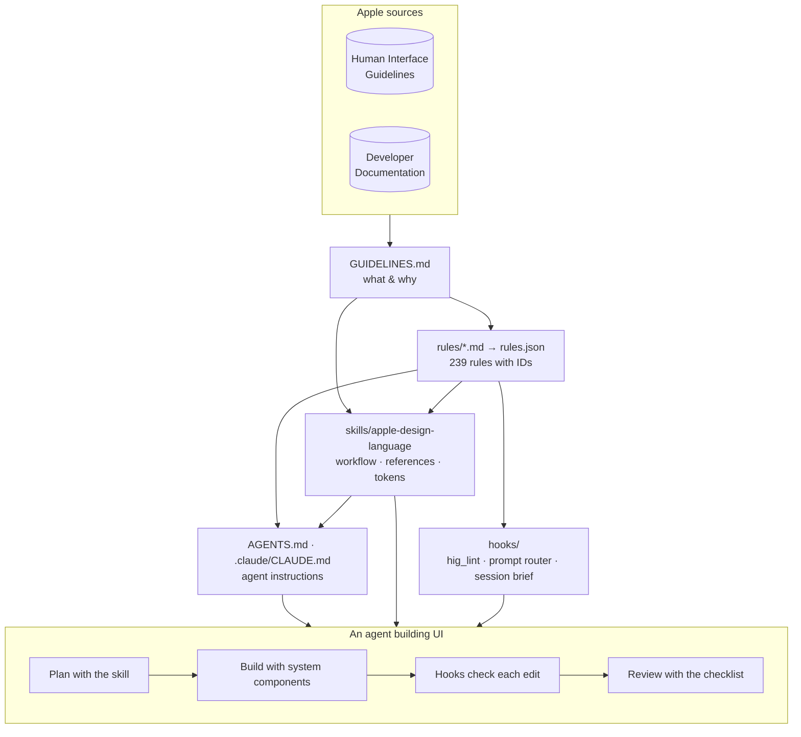

# Apple Design Language

### A researched design system that teaches AI agents to build apps for the Apple ecosystem

**Created by Edison Augustin X.**

`GUIDELINES.md` · `rules/` (239 rules) · `skills/apple-design-language/` · `AGENTS.md` + `.claude/CLAUDE.md` · `hooks/` · Claude Code plugin

---

AI agents write a lot of interface code for iPhone, iPad, Mac, Apple TV, Apple Vision Pro, and Apple Watch — and much of it quietly breaks the platform: hard-coded colors that ignore Dark Mode, fixed font sizes that ignore Dynamic Type, 24-point tap targets, glass effects on every card, tab bars that perform actions, layouts that branch on `UIDevice`.

**Apple Design Language** gives any agent the knowledge and the guardrails to do it right. It condenses Apple’s Human Interface Guidelines and Developer Documentation into a layered package — a readable source of truth, enforceable rules with IDs, a skill with decision guides and code, and hooks that check every edited UI file — so apps feel native on each Apple device **and** consistent across all of them.

> **What this is not:** a way to clone Apple devices, Apple’s own apps, logos, or system UI. The package explicitly teaches agents to avoid Apple trademarks, hardware replicas, SF Symbols in logos or app icons, and imitation system screens ([`rules/15-brand-legal.md`](rules/15-brand-legal.md)).

---

## Contents

- [Why this exists](#why-this-exists)
- [What’s inside](#whats-inside)
- [How the pieces fit](#how-the-pieces-fit)
- [Quick start](#quick-start)
- [What agents do with it](#what-agents-do-with-it)
- [Design sync across Apple platforms](#design-sync-across-apple-platforms)
- [How it was researched and verified](#how-it-was-researched-and-verified)
- [Commands](#commands)
- [Keeping it current](#keeping-it-current)
- [Repository layout](#repository-layout)
- [License and trademarks](#license-and-trademarks)

---

## Why this exists

| Without it, agents often… | With it, agents… | Rule |
|---|---|---|
| Hard-code `Color(red:green:blue:)` | Use semantic system colors that adapt to Dark Mode and Increase Contrast | COL-01 |
| Use `.font(.system(size: 13))` | Use text styles that scale with Dynamic Type up to AX5 | TYP-01 |
| Ship 24×24 pt icon buttons with no label | Give every control a ≥ 44×44 pt hit region and a VoiceOver label | A11Y-01, A11Y-03 |
| Branch layouts on `UIDevice.current.userInterfaceIdiom` | Adapt with size classes, so iPad windows, Mac, and iPhone Duo just work | LAY-01 |
| Put Liquid Glass on cards and backgrounds | Keep glass in the functional layer — controls and navigation only | GLS-01 |
| Add a “+” tab to the tab bar | Keep tabs for navigation and put actions in toolbars | NAV-01 |
| Build a different app per device | Keep one feature set, glossary, and color meaning everywhere | SYNC-01 |
| Guess at values from memory | Use values verified against Apple’s current documentation | — |

---

## What’s inside

| Layer | What it gives an agent | Size |
|---|---|---|
| [**`GUIDELINES.md`**](GUIDELINES.md) | The design language: principles, cross-platform sync, layout, Liquid Glass, color, typography, iconography, motion, haptics, accessibility, writing, components, patterns, inputs, per-platform guides, API map, legal boundaries, review checklist — topic sections cite their Apple sources | 20 sections |
| [**`rules/`**](rules/README.md) | Enforceable rules with stable IDs (e.g., `COL-01`), RFC 2119 levels, severities, platforms, and sources; generated [`rules.json`](rules/rules.json) for tools | **239 rules** · 77 errors · 160 warnings · 2 info |
| [**`skills/apple-design-language/`**](skills/apple-design-language/SKILL.md) | A Claude Code skill: 7-step workflow, non-negotiables, and 10 on-demand references (platforms, navigation, components, Liquid Glass, design tokens, accessibility, writing, SwiftUI recipes, web adaptation, review checklist), plus design tokens and evals | 97-line `SKILL.md` · 10 references |
| [**`AGENTS.md`**](AGENTS.md) · [**`.claude/CLAUDE.md`**](.claude/CLAUDE.md) | Shared instructions any coding agent reads (Codex, Cursor, Copilot, Jules, Amp, Claude Code), plus Claude-specific additions | 116 + 10 lines |
| [**`hooks/`**](hooks/README.md) | A rule checker for Swift, CSS, HTML, JS/TS/JSX, plists, and font files; a prompt router; a session brief — wired as Claude Code hooks and usable from any CLI or CI | 21 automated rules · 60 tests |
| [**`.claude-plugin/`**](.claude-plugin/plugin.json) | Plugin manifest and marketplace so the whole package installs with `/plugin` | v1.0.0 |

---

## How the pieces fit



**Order of authority** when anything disagrees: Apple’s live documentation → `GUIDELINES.md` → `rules/` → skill references.

---

## Quick start

### Claude Code — install as a plugin (recommended)

```text
/plugin marketplace add Agentic-ai-ui/eg4y
/plugin install apple-design-language@eg4y
```

You get the `apple-design-language` skill and three hooks. Always-on cost is about 360 tokens per session; the skill loads its references only when a task needs them.

Try it:

```text
Build the root navigation for a SwiftUI recipe app on iPhone, iPad, and Mac —
sections Recipes, Meal Plan, Shopping List, and Search.
```

```text
Review Sources/Settings/SettingsView.swift against the Apple design rules.
```

### Any coding agent (Codex, Cursor, Copilot, Jules, Amp, …)

Copy this package into your repository (or a subfolder). Agents that support the [AGENTS.md](https://agents.md) convention read [`AGENTS.md`](AGENTS.md) automatically; it points them to the guidelines, rules, skill references, and checker.

### Claude Code without the plugin

Copy the package into your project, then merge [`hooks/settings.example.json`](hooks/settings.example.json) into `.claude/settings.json` (adjust the paths if the package isn’t at the project root). Use either the plugin **or** the settings hooks, not both.

### CI or a local check

```bash
python3 hooks/scripts/hig_lint.py Sources/ Web/     # exits 1 when it finds an error
```

Python 3.9+ standard library only — no dependencies.

### Web projects for Apple devices

Link [`skills/apple-design-language/assets/tokens.css`](skills/apple-design-language/assets/tokens.css) and follow [`references/web-adaptation.md`](skills/apple-design-language/references/web-adaptation.md): system font stacks (never bundled SF fonts), the HIG’s 12 system colors with dark and increased-contrast variants, text styles that follow iOS Dynamic Type in Safari, 44 px targets, safe areas, and Reduce Motion.

---

## What agents do with it

**1. Plan before building.** Identify platforms, surface, and minimum OS; design one information architecture; map it to each platform’s container.

**2. Build with system components** — they bring Liquid Glass, Dark Mode, Dynamic Type, accessibility, and right-to-left layout for free.

**3. Get checked on every edit.** When Claude writes a UI file, the PostToolUse hook reports violations with rule IDs, fixes, and links:

```text
hig-lint: 2 error(s), 0 warning(s), 0 info in 1 file(s) checked
  error   TYP-01   Caption.swift:1  Fixed point size doesn't scale with Dynamic Type.
          fix: Use a text style: `.font(.body)`, `.headline`, `.caption`… or `UIFont.preferredFont(forTextStyle:)`.
          rule: MUST — Use built-in text styles (rules/05-typography.md#typ-01--use-built-in-text-styles)
  error   TYP-02   Caption.swift:1  Text is 9 pt — below the 11 pt minimum on iOS/iPadOS.
          fix: Use at least 11 pt (on iOS, `.caption2` is 11 pt).
```

*(Captured from a real headless Claude Code session with the plugin installed.)*

**4. Review with the checklist** and report errors first, citing rule IDs — using the template in [`review-checklist.md`](skills/apple-design-language/references/review-checklist.md).

**5. Justify exceptions explicitly.** Deliberate deviations carry a reason, or the checker keeps reporting them:

```swift
.preferredColorScheme(.dark) // hig-ignore: COL-07 — immersive video player stays dark
```

---

## Design sync across Apple platforms

One app, one identity — expressed in each platform’s idiom.

| | iPhone | iPad | Mac | Apple TV | Vision Pro | Apple Watch |
|---|---|---|---|---|---|---|
| **Navigation** | Floating tab bar | Tab bar ⇄ sidebar | Sidebar + menu bar | Top tab bar + focus | Vertical tab bar in a glass window | List / pages + Digital Crown |
| **Default / min text** | 17 / 11 pt | 17 / 11 pt | 13 / 10 pt | 29 / 23 pt | 17 / 12 pt | 16 / 12 pt |
| **Default control** | 44 pt | 44 pt | 28 pt | 66 pt | 60 pt | 44 pt |

**Stays identical everywhere:** features, terminology, color meanings, symbols, app icon, toolbar groupings, iPad ↔ Mac search (SYNC-01 – SYNC-07). **Adapts:** navigation container, input model, metrics, density. Includes guidance for **iPhone Duo** — two displays, device poses, vertical controls, and reserved regions. Full playbook: [`references/platforms.md`](skills/apple-design-language/references/platforms.md).

---

## How it was researched and verified

Everything in this package was researched rather than recalled:

- **Human Interface Guidelines:** all 173 pages retrieved from Apple’s documentation data; about 65 read in full for the guidelines and rules. Content current through **September 2026** (Liquid Glass, iOS 27 era, iPhone Duo).
- **Exact values from Apple’s data**, extracted by script rather than transcribed: 12 system colors × 4 variants, 6 system grays, every iOS and watchOS Dynamic Type size (including AX sizes), macOS and tvOS text styles, control sizes, contrast minimums, layout, and icon specs.
- **API names** (~150 SwiftUI, UIKit, and AppKit symbols) checked against Apple’s published declarations and availability. The Swift snippets weren’t compiled here (that needs Xcode), and each reference says so.
- **Web support** checked against MDN browser-compat-data 8.1.3 and WebKit’s documentation — for example, `prefers-reduced-transparency` isn’t supported in Safari, so the web tokens also fall back on Increase Contrast.
- **Computed, not assumed:** the WCAG contrast of every system color. In light mode only indigo reaches 4.5:1 as text on white; every increased-contrast variant does ([`design-tokens.md`](skills/apple-design-language/references/design-tokens.md#contrast-of-system-colors)).
- **Tested:** 60 hook tests on Python 3.9–3.13, including one that runs every Swift/CSS/HTML snippet in the skill through the checker; `tokens.css` verified in Chromium across light, dark, Increase Contrast, and Reduce Motion; the plugin passes `claude plugin validate --strict`, installs, and its hooks fire in a live session.
- **Consistency enforced by tools:** rule IDs, levels, anchors, and cross-references are validated by `build_rules.py`; tokens by `build_tokens.py`; checker coverage of every automated rule by the test suite.

---

## Commands

```bash
# Check UI files (Swift, CSS, HTML, JS/TS/JSX, plists, fonts)
python3 hooks/scripts/hig_lint.py <files-or-directories>
python3 hooks/scripts/hig_lint.py --format json --min-severity error App/
python3 hooks/scripts/hig_lint.py --list-rules

# Validate rules and regenerate rules.json + the rules index
python3 rules/tools/build_rules.py                      # --check in CI

# Validate tokens and regenerate tokens.css + design-tokens.md
python3 skills/apple-design-language/scripts/build_tokens.py   # --check in CI

# Run the hook tests
python3 -m unittest discover -s hooks/tests

# Validate the plugin and marketplace
claude plugin validate . && claude plugin validate .claude-plugin/plugin.json
```

[CI](.github/workflows/ci.yml) runs all of these on every pull request and every push to `main`: generated files up to date, the hook tests on Python 3.9–3.13, and strict plugin validation.

---

## Keeping it current

Apple updates the HIG throughout the year; each HIG page has a change log.

1. Re-read the changed Apple pages and update **`GUIDELINES.md`** first.
2. Update the affected **`rules/`** — never renumber or reuse a rule ID — and run `build_rules.py`.
3. Update **skill references** and `assets/tokens.json`, then run `build_tokens.py`.
4. If a rule is `Check: hook`, update its detector and tests in **`hooks/`**.
5. Bump `version` in **`.claude-plugin/plugin.json`** so installed users receive the update, and add that version’s section to **[`CHANGELOG.md`](CHANGELOG.md)**.
6. After the change merges, push the tag `v<version>` on `main`; the [release workflow](.github/workflows/release.yml) checks the tag against the manifest, reruns the checks, and publishes the GitHub release with the changelog notes.

Conventions for contributors and agents are in [`AGENTS.md` › Maintaining this package](AGENTS.md#maintaining-this-package).

---

## Repository layout

```text
.
├── README.md                          ← you are here
├── LICENSE                            ← MIT
├── CHANGELOG.md                       ← release notes, one section per version
├── GUIDELINES.md                      ← the design language, with Apple sources
├── AGENTS.md                          ← instructions for any coding agent
├── .claude/CLAUDE.md                  ← Claude Code additions (imports AGENTS.md)
├── .github/workflows/ci.yml           ← CI: generated files, tests (Python 3.9–3.13), plugin validation
├── .github/workflows/release.yml      ← publishes the GitHub release when a v* tag is pushed
├── .claude-plugin/
│   ├── plugin.json                    ← plugin manifest
│   └── marketplace.json               ← marketplace “eg4y”
├── rules/
│   ├── README.md                      ← rule format + generated index
│   ├── 00-core.md … 15-brand-legal.md ← 16 rule files, 239 rules
│   ├── rules.json                     ← generated registry
│   └── tools/build_rules.py           ← validator / generator
├── skills/apple-design-language/
│   ├── SKILL.md                       ← workflow, non-negotiables, routing
│   ├── references/                    ← 10 on-demand references
│   ├── assets/tokens.json             ← single source of truth for values
│   ├── assets/tokens.css              ← generated web tokens
│   ├── scripts/build_tokens.py        ← validator / generator
│   └── evals/evals.json               ← test prompts with rule-ID assertions
└── hooks/
    ├── README.md                      ← coverage, protocol, install
    ├── hooks.json                     ← plugin hook wiring
    ├── settings.example.json          ← project hook wiring
    ├── scripts/                       ← hig_lint.py · prompt_router.py · session_context.py
    └── tests/test_hooks.py            ← 60 tests
```

---

## License and trademarks

**License:** [MIT](LICENSE) © 2026 Edison Augustin X. You may use, copy, modify, and distribute this package, including commercially, provided the copyright and license notice are kept. The MIT license covers this project’s own content; it grants no rights in Apple’s trademarks or documentation.

**Trademarks:** Apple, iPhone, iPad, Mac, Apple TV, Apple Watch, Apple Vision Pro, iPadOS, macOS, tvOS, visionOS, watchOS, SF Symbols, San Francisco, and New York are trademarks of Apple Inc. **This project is independent and unofficial — it is not affiliated with, endorsed by, or sponsored by Apple Inc.** It summarizes and links to Apple’s publicly available Human Interface Guidelines and Developer Documentation; consult those sources for authoritative guidance. The guidelines are written in original wording with short, attributed quotations (such as the design-principle taglines) rather than copied pages, and Apple system fonts and symbol artwork are not included.

---

**Created by Edison Augustin X.**
