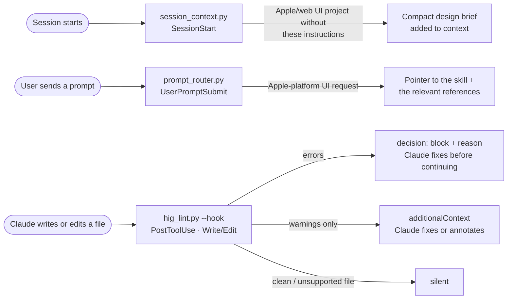

# Hooks — Apple Design Language

> **Created by Edison Augustin X.**
> Automated checks and context for AI agents building Apple-platform interfaces. Python 3.9+ standard library only — no dependencies.

The hooks enforce the rules marked **`Check: hook`** in [`rules/`](../rules/README.md) (22 of 245) and help Claude Code find the right guidance at the right moment. The other rules need judgment and are covered by the [review checklist](../skills/apple-design-language/references/review-checklist.md).



## Contents

| File | Role |
|---|---|
| [`hooks.json`](hooks.json) | Plugin hook configuration (uses `${CLAUDE_PLUGIN_ROOT}`) |
| [`settings.example.json`](settings.example.json) | Same hooks for a project’s `.claude/settings.json` (uses `${CLAUDE_PROJECT_DIR}`) |
| [`scripts/hig_lint.py`](scripts/hig_lint.py) | Rule checker — CLI and PostToolUse hook |
| [`scripts/prompt_router.py`](scripts/prompt_router.py) | UserPromptSubmit hook — routes Apple UI requests to skill references |
| [`scripts/session_context.py`](scripts/session_context.py) | SessionStart hook — compact brief in Apple/web UI projects |
| [`tests/test_hooks.py`](tests/test_hooks.py) | 71 tests: every rule, suppression, CLI, the exact hook protocol, routing, the docs’ rule citations, and the skill’s code snippets |

## Install

**As a Claude Code plugin** (recommended): installing this package as a plugin loads `hooks/hooks.json` automatically.

**In a project without the plugin:** copy this package into your repository (or a subfolder), then merge [`settings.example.json`](settings.example.json) into `.claude/settings.json`, adjusting the paths if the package isn’t at the project root. Don’t enable both the plugin and project copies — Claude Code runs a plugin’s hooks separately from settings hooks, so each check would run twice.

**Other agents and CI:** run the checker directly (below). It exits `1` when it finds an error.

## The checker — `hig_lint.py`

```bash
python3 hooks/scripts/hig_lint.py Sources/ Web/styles.css         # files or directories
python3 hooks/scripts/hig_lint.py --format json App/              # machine-readable
python3 hooks/scripts/hig_lint.py --min-severity error App/       # errors only
python3 hooks/scripts/hig_lint.py --list-rules                    # coverage of every hook rule
```

**Checks:** Swift (`.swift`), CSS/Sass/Less, HTML, Vue/Svelte/Astro components (markup, inline `<style>`, and scripts), JS/TS/JSX/TSX for React, Next.js, and React Native (inline styles, styled-components, markup in JSX, Tailwind classes), `Info.plist` (`UIAppFonts`), `.strings`/`.xcstrings`, and bundled font files (`.otf/.ttf/.woff/.woff2`). Directory scans skip `.git`, `node_modules`, `build`, `DerivedData`, `Pods`, and similar.

**Severity comes from `rules/rules.json`** (MUST → error, SHOULD → warning), so the checker and the rules can’t drift. The tests fail if a `Check: hook` rule lacks a detector or a detector reports a rule that isn’t marked `hook`.

### Rules checked automatically

| Rule | Severity | Swift detects | Web and React Native detect |
|---|---|---|---|
| LAY-01 | error | `UIDevice.current.userInterfaceIdiom`, `UIScreen.main.bounds`, device orientation | User-agent sniffing for iPhone/iPad/Mac; React Native `Platform.isPad`, `DeviceInfo.isTablet()` |
| GLS-02 | warning | More than 3 `.glassEffect` views in a file | — |
| GLS-04 | warning | `.toolbarBackground(<color>)`, `.presentationBackground`, opaque UIKit bar appearances | — |
| GLS-08 | warning | 2+ `.glassEffect` views without `GlassEffectContainer` | — |
| COL-01 | error | `Color(red:…)`, `UIColor(red:…)`, `#colorLiteral`, hex initializers (files named `*Colors/Theme/Palette/Tokens.swift` are exempt) | Hard-coded Apple system color hex values (from `tokens.json`) in CSS, style objects, strings, and Tailwind arbitrary values (`bg-[#…]`) |
| COL-07 | error | `.preferredColorScheme`, `overrideUserInterfaceStyle` | `color-scheme: light` / meta locked to one appearance; React Native `Appearance.setColorScheme()` |
| TYP-01 | error | `.system(size:)`, `UIFont.systemFont(ofSize:)` (skipped in AppKit-only files) | — |
| TYP-02 | error | Sizes below 11 pt (10 pt in AppKit-only files) | `font-size` / `fontSize` below 11 px; Tailwind `text-[10px]` |
| TYP-03 | warning | `.ultraLight`, `.thin`, `.light` weights | `font-weight` 100–300; Tailwind `font-thin/extralight/light` |
| TYP-04 | error | Loading SF / New York by name | `@font-face` or links to SF/New York files; `UIAppFonts` entries; bundled font files |
| TYP-05 | error | `Font.custom(_:size:)` without `relativeTo:`; `UIFont(name:size:)` without `UIFontMetrics` | — |
| TYP-08 | warning | `.lineLimit(1)` | — |
| MOT-02 | error | Custom animation without a Reduce Motion check | Animations/transitions without `prefers-reduced-motion` |
| A11Y-01 | error | Tappable `.frame(width:height:)` under 44 pt (28 pt on macOS) | Interactive selectors under 44 px; Tailwind `size-*`/`h-* w-*` under 44 px on buttons and links |
| A11Y-03 | error | Icon-only `Button`/tap gesture without an accessibility label | `<button>`/`<a>` without an accessible name (JSX expressions count; `aria-hidden` icons don’t); React Native `Pressable`/`Touchable*` with no text and no label |
| A11Y-04 | error | Asset `Image("…")` without a label or decorative marking | `` without `alt` |
| A11Y-05 | warning | — | `user-scalable=no`, `maximum-scale=1`; Next.js `maximumScale: 1` / `userScalable: false`; React Native `allowFontScaling={false}`, `maxFontSizeMultiplier` ≤ 1 |
| WRT-02 | warning | “Click here” in strings | “Click here” in markup and scripts |
| NAV-09 | error | Text buttons labeled “Back” or “Close” | — |
| CMP-13 | warning | `Button("Yes"/"No")`, `UIAlertAction(title: "Yes"/"No")` | — |
| CMP-21 | error | `TextField` labeled “Password” | Password inputs not `type="password"` |
| STK-03 | warning | — | Click handlers on `<div>`/`<span>`/… without a role (`onClick`, `onclick`, Vue `@click`, Svelte `onclick`) |

### Suppressing a finding

A deliberate, justified exception goes on the same line or the line above, **with a reason** (separated by `—`, `–`, `-`, `--`, or `:`). Suppressions without a reason are ignored.

```swift
.preferredColorScheme(.dark) // hig-ignore: COL-07 — immersive video player stays dark
```

```css
/* hig-ignore: TYP-02, TYP-03 — print-only legal footnote */
```

### Limits

`hig_lint.py` is a fast, pattern-based checker, not a compiler: it can’t see runtime values, view hierarchies across files, or platform targets beyond `import AppKit`. Expect occasional false positives (annotate them with a reason) and false negatives (the review checklist covers them). Comments are ignored in Swift and CSS.

## Hook protocol (Claude Code)

Implemented to the [Claude Code hooks reference](https://code.claude.com/docs/en/hooks):

| Hook | Event / matcher | Input used | Output |
|---|---|---|---|
| `hig_lint.py --hook` | `PostToolUse` · `Write\|Edit\|MultiEdit` | `tool_input.file_path` (absolute), `cwd` | Errors → `{"decision": "block", "reason": …}` so Claude sees the findings next to the tool result (the edit has already happened; PostToolUse can’t undo it). Warnings only → `hookSpecificOutput.additionalContext`. Clean or unsupported file → no output. Always exits 0; output capped below the 10,000-character limit. |
| `prompt_router.py` | `UserPromptSubmit` | `prompt` | Plain-text note (added to Claude’s context) naming the skill and up to six relevant references — the stack’s recipes first (React, Next.js, Tailwind, Vue/Svelte, HTML/CSS, React Native) — only when the prompt mentions an Apple platform or technology. Never blocks prompts. |
| `session_context.py` | `SessionStart` (all sources) | `cwd`, `CLAUDE_PROJECT_DIR` | Plain-text brief, only in Apple/web UI projects whose `CLAUDE.md`/`AGENTS.md` don’t already load these instructions (avoids duplicating context). |

All handlers use exec form (`"command": "python3", "args": [...]`), as the hooks reference recommends for paths containing placeholders.

**Environment variables**

| Variable | Effect |
|---|---|
| `HIG_LINT=off` | Disables all three hooks |
| `HIG_LINT_MIN_SEVERITY=error\|warning\|info` | Lowest severity the PostToolUse hook reports (default `warning`) |

## Tests

```bash
python3 -m unittest discover -s hooks/tests -v
```

71 tests cover positive and negative cases for every hook rule (Swift, CSS, HTML, JSX, Vue, Svelte, Tailwind, React Native, Next.js), suppression (with and without reasons, multiple IDs, line above), CLI exit codes and JSON output, the PostToolUse stdin/stdout contract (block vs. context, silence, severity filter, disable switch, malformed input, output cap), prompt routing (each stack to its recipes; unrelated “apple” prompts stay silent), session context (brief, already-instructed, non-UI projects), both configuration files, rule IDs cited anywhere in the docs (each must exist), the skill description limit, the generated token files, and every Swift, CSS, HTML, TS/TSX, Vue, and Svelte snippet in the skill’s references (each must pass the checker). CI ([`.github/workflows/ci.yml`](../.github/workflows/ci.yml)) runs the suite on Python 3.9, 3.10, 3.11, 3.12, and 3.13.

## Adding a detector

1. Mark the rule `Check: hook` in `rules/*.md` and rebuild (`python3 rules/tools/build_rules.py`).
2. Add the detector in `hig_lint.py` and its ID to `DETECTED_RULES`.
3. Add positive and negative tests in `tests/test_hooks.py`.
4. Update the coverage table above.
