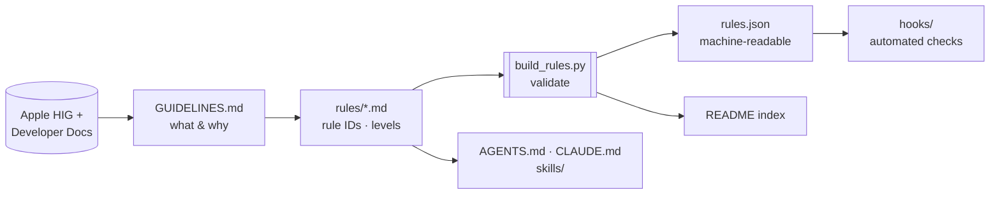

# Rules — Apple Design Language

> **Created by Edison Augustin X.**
> Enforceable, ID-addressable rules for designing apps across the Apple ecosystem.
> Every rule is derived from [`GUIDELINES.md`](../GUIDELINES.md) and cites the Apple page it comes from.

`GUIDELINES.md` explains **what** the Apple design language is and **why**. This folder turns it into **checkable rules** that agents follow while designing, that reviewers cite by ID, and that the hooks in [`../hooks/`](../hooks/) enforce automatically where a machine can.



---

## Files

| File | Prefix | Covers |
|---|---|---|
| [`00-core.md`](00-core.md) | `SYS` | System-first, recoverability, system settings, state restoration, multitasking |
| [`01-cross-platform-sync.md`](01-cross-platform-sync.md) | `SYNC` | What stays identical across iPhone, iPad, Mac, TV, Vision Pro, Watch |
| [`02-layout.md`](02-layout.md) | `LAY` | Size classes, safe areas, adaptability, hierarchy, platform layout specs |
| [`03-materials-liquid-glass.md`](03-materials-liquid-glass.md) | `GLS` | Liquid Glass layer rules, variants, scroll edge effects, standard materials |
| [`04-color.md`](04-color.md) | `COL` | Semantic colors, contrast, Dark Mode, accent color |
| [`05-typography.md`](05-typography.md) | `TYP` | Text styles, Dynamic Type, minimum sizes, weights, custom fonts |
| [`06-iconography.md`](06-iconography.md) | `ICN` | SF Symbols, interface icons, app icons, image assets |
| [`07-motion-haptics.md`](07-motion-haptics.md) | `MOT`, `HAP` | Purposeful motion, Reduce Motion, haptic patterns |
| [`08-accessibility.md`](08-accessibility.md) | `A11Y` | Hit targets, VoiceOver, text enlargement, media, keyboard, comfort |
| [`09-writing-localization.md`](09-writing-localization.md) | `WRT`, `L10N` | Labels, capitalization, errors, inclusive language, right-to-left |
| [`10-navigation.md`](10-navigation.md) | `NAV` | Tab bars, sidebars, split views, toolbars, search |
| [`11-components.md`](11-components.md) | `CMP` | Buttons, modality, sheets, alerts, menus, lists, input controls |
| [`12-patterns.md`](12-patterns.md) | `PAT`, `PRV`, `AI` | Launch, onboarding, loading, feedback, settings, privacy, generative AI |
| [`13-inputs.md`](13-inputs.md) | `INP` | Gestures, keyboard shortcuts, focus, eyes, double tap |
| [`14-platforms.md`](14-platforms.md) | `PLT-*` | iOS, iPadOS, iPhone Duo, macOS, tvOS, visionOS, watchOS specifics |
| [`15-brand-legal.md`](15-brand-legal.md) | `BRD` | Trademarks, hardware replicas, SF Symbols terms, no fake system UI |
| [`rules.json`](rules.json) | — | Generated machine-readable registry (don’t edit by hand) |
| [`tools/build_rules.py`](tools/build_rules.py) | — | Validator and generator |

---

## Anatomy of a rule

```markdown
### COL-01 · Use system colors through their APIs
- **Level:** MUST NOT
- **Severity:** error
- **Platforms:** All
- **Check:** hook
- **Rule:** MUST NOT hard-code system or semantic color values in views; …
- **Why:** (optional) the reason, in one sentence
- **Do:** (optional) a correct example
- **Don't:** (optional) an incorrect example
- **Source:** [HIG › Color](https://developer.apple.com/…) · [GUIDELINES §5](../GUIDELINES.md#5-color)
```

| Field | Values | Notes |
|---|---|---|
| **ID** | `PREFIX-NN` | Stable forever. Never renumber or reuse an ID; retire a rule by marking it deprecated in its text. |
| **Level** | `MUST`, `MUST NOT`, `SHOULD`, `SHOULD NOT`, `MAY` | [RFC 2119](https://www.rfc-editor.org/rfc/rfc2119) meaning. The rule text starts with this keyword. |
| **Severity** | `error`, `warning`, `info` | Fixed by level: MUST/MUST NOT → `error` · SHOULD/SHOULD NOT → `warning` · MAY → `info`. |
| **Platforms** | `All` or a list of `iOS`, `iPadOS`, `macOS`, `tvOS`, `visionOS`, `watchOS` | iPhone Duo rules use `iOS`. |
| **Check** | `hook` or `review` | `hook` = the automated checker in `hooks/` detects violations; `review` = needs human or agent judgment. |
| **Source** | Links | At least one `developer.apple.com` page and one `GUIDELINES.md` section. |

### How levels map to agent behavior

| Level | Agent must… |
|---|---|
| `MUST` / `MUST NOT` (**error**) | Never ship a violation. Fix it before presenting work. |
| `SHOULD` / `SHOULD NOT` (**warning**) | Follow by default. Deviate only with a stated reason that names a design principle (SYS-06). |
| `MAY` (**info**) | Consider when it fits. |

### Suppressing a finding

When a deliberate, justified exception is needed, annotate the line (or the line above it) with the rule ID **and a reason**. The hooks ignore findings that carry this marker; findings without a reason are not suppressed.

```swift
.preferredColorScheme(.dark) // hig-ignore: COL-07 — full-screen video player is intentionally dark
```

```css
/* hig-ignore: TYP-02 — legal footnote rendered at 10px only in print stylesheet */
```

---

## Working with the rules

```bash
# Validate every rule and regenerate rules.json + the index below
python3 rules/tools/build_rules.py

# CI: validate and fail if rules.json or the index is stale
python3 rules/tools/build_rules.py --check
```

The validator enforces: unique, gap-free IDs per prefix; all required fields; level ↔ severity consistency; rule text starting with its level keyword; known platforms and check types; at least one Apple source; `GUIDELINES.md` anchors that exist; and cross-references (e.g., “see ICN-02”) that point at real rules.

**Adding a rule:** add it to the right file with the next free number → cite Apple and `GUIDELINES.md` → run the build → if `Check: hook`, implement the detector in `hooks/` in the same change.

**Updating for a new Apple release:** re-read the changed HIG pages (each page has a change log), update `GUIDELINES.md` first, then the affected rules, then rebuild.

---

## Rule index

<!-- BEGIN RULE INDEX (generated by rules/tools/build_rules.py — do not edit) -->

**239 rules** · 77 error · 160 warning · 2 info · 21 checked automatically by hooks

| ID | Rule | Level | Platforms | Check |
|---|---|---|---|---|
| [SYS-01](00-core.md#sys-01--prefer-standard-system-components) | Prefer standard system components | SHOULD | All | review |
| [SYS-02](00-core.md#sys-02--make-actions-recoverable) | Make actions recoverable | SHOULD | All | review |
| [SYS-03](00-core.md#sys-03--respect-systemwide-settings) | Respect systemwide settings | MUST NOT | All | review |
| [SYS-04](00-core.md#sys-04--restore-state-on-relaunch) | Restore state on relaunch | SHOULD | All | review |
| [SYS-05](00-core.md#sys-05--work-well-with-multitasking) | Work well with multitasking | MUST | iOS, iPadOS, macOS, tvOS, visionOS | review |
| [SYS-06](00-core.md#sys-06--name-the-principle-behind-non-obvious-decisions) | Name the principle behind non-obvious decisions | SHOULD | All | review |
| [SYS-07](00-core.md#sys-07--dont-decorate-in-the-name-of-delight) | Don’t decorate in the name of delight | SHOULD NOT | All | review |
| [SYNC-01](01-cross-platform-sync.md#sync-01--keep-functionality-the-same-everywhere) | Keep functionality the same everywhere | MUST NOT | All | review |
| [SYNC-02](01-cross-platform-sync.md#sync-02--one-glossary-for-every-platform) | One glossary for every platform | SHOULD | All | review |
| [SYNC-03](01-cross-platform-sync.md#sync-03--same-color-meanings-everywhere) | Same color meanings everywhere | SHOULD | All | review |
| [SYNC-04](01-cross-platform-sync.md#sync-04--visually-consistent-app-icon-across-platforms) | Visually consistent app icon across platforms | SHOULD | All | review |
| [SYNC-05](01-cross-platform-sync.md#sync-05--same-symbols-for-the-same-actions) | Same symbols for the same actions | SHOULD | All | review |
| [SYNC-06](01-cross-platform-sync.md#sync-06--consistent-toolbar-groupings-and-placement) | Consistent toolbar groupings and placement | SHOULD | iOS, iPadOS, macOS, visionOS | review |
| [SYNC-07](01-cross-platform-sync.md#sync-07--consistent-search-between-ipad-and-mac) | Consistent search between iPad and Mac | SHOULD | iPadOS, macOS | review |
| [SYNC-08](01-cross-platform-sync.md#sync-08--adapt-the-container-keep-the-architecture) | Adapt the container, keep the architecture | SHOULD | All | review |
| [SYNC-09](01-cross-platform-sync.md#sync-09--give-every-platform-the-same-care) | Give every platform the same care | SHOULD | All | review |
| [SYNC-10](01-cross-platform-sync.md#sync-10--match-context-menu-actions-to-swipe-actions) | Match context menu actions to swipe actions | SHOULD | iOS, iPadOS, macOS, visionOS | review |
| [LAY-01](02-layout.md#lay-01--decide-layout-from-size-classes-not-device-or-orientation) | Decide layout from size classes, not device or orientation | MUST | iOS, iPadOS, tvOS, visionOS | hook |
| [LAY-02](02-layout.md#lay-02--respect-safe-areas-and-layout-guides) | Respect safe areas and layout guides | MUST | All | review |
| [LAY-03](02-layout.md#lay-03--adapt-to-every-size-class-combination) | Adapt to every size-class combination | MUST | iOS, iPadOS, macOS, visionOS | review |
| [LAY-04](02-layout.md#lay-04--make-layout-respond-to-text-size) | Make layout respond to text size | MUST | iOS, iPadOS, tvOS, visionOS, watchOS | review |
| [LAY-05](02-layout.md#lay-05--order-content-by-importance) | Order content by importance | SHOULD | All | review |
| [LAY-06](02-layout.md#lay-06--align-indent-and-group-deliberately) | Align, indent, and group deliberately | SHOULD | All | review |
| [LAY-07](02-layout.md#lay-07--use-progressive-disclosure) | Use progressive disclosure | SHOULD | All | review |
| [LAY-08](02-layout.md#lay-08--separate-controls-from-content-with-liquid-glass) | Separate controls from content with Liquid Glass | MUST | iOS, iPadOS, macOS, tvOS, watchOS | review |
| [LAY-09](02-layout.md#lay-09--extend-backgrounds-beneath-bars) | Extend backgrounds beneath bars | SHOULD | iOS, iPadOS, macOS | review |
| [LAY-10](02-layout.md#lay-10--scale-artwork-never-distort-it) | Scale artwork, never distort it | SHOULD | All | review |
| [LAY-11](02-layout.md#lay-11--nest-corners-concentrically) | Nest corners concentrically | SHOULD | iOS, iPadOS, macOS | review |
| [LAY-12](02-layout.md#lay-12--macos-keep-critical-items-off-the-window-bottom) | macOS: keep critical items off the window bottom | SHOULD NOT | macOS | review |
| [LAY-13](02-layout.md#lay-13--tvos-honor-the-safe-area) | tvOS: honor the safe area | MUST | tvOS | review |
| [LAY-14](02-layout.md#lay-14--tvos-use-grid-specifications) | tvOS: use grid specifications | SHOULD | tvOS | review |
| [LAY-15](02-layout.md#lay-15--visionos-space-interactive-items-for-eyes) | visionOS: space interactive items for eyes | SHOULD | visionOS | review |
| [LAY-16](02-layout.md#lay-16--watchos-limit-controls-per-row) | watchOS: limit controls per row | SHOULD NOT | watchOS | review |
| [GLS-01](03-materials-liquid-glass.md#gls-01--no-liquid-glass-in-the-content-layer) | No Liquid Glass in the content layer | MUST NOT | iOS, iPadOS, macOS, tvOS, watchOS | review |
| [GLS-02](03-materials-liquid-glass.md#gls-02--use-custom-glass-sparingly) | Use custom glass sparingly | SHOULD | iOS, iPadOS, macOS, tvOS, watchOS | hook |
| [GLS-03](03-materials-liquid-glass.md#gls-03--no-glass-on-glass) | No glass on glass | MUST NOT | iOS, iPadOS, macOS, tvOS, watchOS | review |
| [GLS-04](03-materials-liquid-glass.md#gls-04--remove-custom-bar-and-sheet-backgrounds) | Remove custom bar and sheet backgrounds | SHOULD | iOS, iPadOS, macOS | hook |
| [GLS-05](03-materials-liquid-glass.md#gls-05--choose-the-right-glass-variant) | Choose the right glass variant | MUST | iOS, iPadOS, macOS, tvOS, watchOS | review |
| [GLS-06](03-materials-liquid-glass.md#gls-06--test-glass-with-accessibility-and-display-settings) | Test glass with accessibility and display settings | MUST | All | review |
| [GLS-07](03-materials-liquid-glass.md#gls-07--use-scroll-edge-effects-correctly) | Use scroll edge effects correctly | SHOULD | iOS, iPadOS, macOS | review |
| [GLS-08](03-materials-liquid-glass.md#gls-08--group-custom-glass-in-a-container) | Group custom glass in a container | SHOULD | iOS, iPadOS, macOS, tvOS, watchOS | hook |
| [GLS-09](03-materials-liquid-glass.md#gls-09--color-on-glass-only-the-primary-action) | Color on glass: only the primary action | MUST NOT | iOS, iPadOS, macOS, tvOS, watchOS | review |
| [GLS-10](03-materials-liquid-glass.md#gls-10--vibrant-colors-on-standard-materials) | Vibrant colors on standard materials | MUST | iOS, iPadOS, macOS, visionOS | review |
| [GLS-11](03-materials-liquid-glass.md#gls-11--visionos-keep-the-glass-window-background) | visionOS: keep the glass window background | SHOULD | visionOS | review |
| [COL-01](04-color.md#col-01--use-system-colors-through-their-apis) | Use system colors through their APIs | MUST NOT | All | hook |
| [COL-02](04-color.md#col-02--give-every-custom-color-all-its-variants) | Give every custom color all its variants | MUST | iOS, iPadOS, macOS, tvOS | review |
| [COL-03](04-color.md#col-03--never-rely-on-color-alone) | Never rely on color alone | MUST NOT | All | review |
| [COL-04](04-color.md#col-04--one-meaning-per-color) | One meaning per color | MUST NOT | All | review |
| [COL-05](04-color.md#col-05--dont-repurpose-semantic-colors) | Don’t repurpose semantic colors | MUST NOT | iOS, iPadOS, macOS, tvOS, visionOS | review |
| [COL-06](04-color.md#col-06--meet-contrast-minimums) | Meet contrast minimums | MUST | All | review |
| [COL-07](04-color.md#col-07--follow-the-system-appearance) | Follow the system appearance | MUST NOT | iOS, iPadOS, macOS, tvOS | hook |
| [COL-08](04-color.md#col-08--prefer-system-background-colors) | Prefer system background colors | SHOULD | iOS, iPadOS | review |
| [COL-09](04-color.md#col-09--apply-the-accent-color-judiciously) | Apply the accent color judiciously | SHOULD | All | review |
| [COL-10](04-color.md#col-10--keep-bars-legible-over-colorful-content) | Keep bars legible over colorful content | SHOULD | iOS, iPadOS, macOS | review |
| [COL-11](04-color.md#col-11--tame-white-images-in-dark-mode) | Tame white images in Dark Mode | SHOULD | iOS, iPadOS, macOS, tvOS | review |
| [COL-12](04-color.md#col-12--manage-color-spaces) | Manage color spaces | SHOULD | All | review |
| [COL-13](04-color.md#col-13--consider-cultural-color-meaning) | Consider cultural color meaning | SHOULD | All | review |
| [COL-14](04-color.md#col-14--use-system-color-pickers) | Use system color pickers | SHOULD | iOS, iPadOS, macOS, visionOS | review |
| [TYP-01](05-typography.md#typ-01--use-built-in-text-styles) | Use built-in text styles | MUST | iOS, iPadOS, tvOS, visionOS, watchOS | hook |
| [TYP-02](05-typography.md#typ-02--never-go-below-the-platform-minimum-size) | Never go below the platform minimum size | MUST NOT | All | hook |
| [TYP-03](05-typography.md#typ-03--avoid-light-font-weights) | Avoid light font weights | SHOULD NOT | All | hook |
| [TYP-04](05-typography.md#typ-04--dont-embed-system-fonts) | Don’t embed system fonts | MUST NOT | All | hook |
| [TYP-05](05-typography.md#typ-05--custom-fonts-must-scale-and-respect-bold-text) | Custom fonts must scale and respect Bold Text | MUST | iOS, iPadOS, tvOS, visionOS, watchOS | hook |
| [TYP-06](05-typography.md#typ-06--minimize-typefaces) | Minimize typefaces | SHOULD | All | review |
| [TYP-07](05-typography.md#typ-07--preserve-hierarchy-at-every-text-size) | Preserve hierarchy at every text size | SHOULD | All | review |
| [TYP-08](05-typography.md#typ-08--minimize-truncation) | Minimize truncation | SHOULD | iOS, iPadOS, tvOS, visionOS, watchOS | hook |
| [TYP-09](05-typography.md#typ-09--scale-meaningful-icons-with-text) | Scale meaningful icons with text | SHOULD | iOS, iPadOS, tvOS, visionOS, watchOS | review |
| [TYP-10](05-typography.md#typ-10--prioritize-what-grows) | Prioritize what grows | SHOULD | iOS, iPadOS, tvOS, visionOS, watchOS | review |
| [TYP-11](05-typography.md#typ-11--avoid-tight-leading-for-long-text) | Avoid tight leading for long text | SHOULD NOT | All | review |
| [TYP-12](05-typography.md#typ-12--use-platform-text-style-tables) | Use platform text style tables | SHOULD | All | review |
| [TYP-13](05-typography.md#typ-13--visionos-keep-text-flat-bold-and-facing-people) | visionOS: keep text flat, bold, and facing people | SHOULD | visionOS | review |
| [ICN-01](06-iconography.md#icn-01--prefer-sf-symbols-for-interface-icons) | Prefer SF Symbols for interface icons | SHOULD | All | review |
| [ICN-02](06-iconography.md#icn-02--use-standard-icons-for-standard-actions) | Use standard icons for standard actions | SHOULD | All | review |
| [ICN-03](06-iconography.md#icn-03--keep-interface-icons-visually-consistent) | Keep interface icons visually consistent | MUST | All | review |
| [ICN-04](06-iconography.md#icn-04--ship-custom-icons-as-vectors) | Ship custom icons as vectors | MUST | All | review |
| [ICN-05](06-iconography.md#icn-05--pick-the-right-rendering-mode-and-variant) | Pick the right rendering mode and variant | SHOULD | All | review |
| [ICN-06](06-iconography.md#icn-06--variable-color-means-change-not-depth) | Variable color means change, not depth | MUST NOT | All | review |
| [ICN-07](06-iconography.md#icn-07--animate-symbols-with-purpose) | Animate symbols with purpose | SHOULD | All | review |
| [ICN-08](06-iconography.md#icn-08--no-custom-selected-states-for-standard-bars) | No custom selected states for standard bars | SHOULD NOT | All | review |
| [ICN-09](06-iconography.md#icn-09--build-app-icons-from-unmasked-layers) | Build app icons from unmasked layers | MUST | All | review |
| [ICN-10](06-iconography.md#icn-10--consistent-icon-across-appearances) | Consistent icon across appearances | MUST | iOS, iPadOS, macOS | review |
| [ICN-11](06-iconography.md#icn-11--keep-app-icons-simple) | Keep app icons simple | SHOULD | All | review |
| [ICN-12](06-iconography.md#icn-12--let-the-system-add-icon-effects) | Let the system add icon effects | SHOULD NOT | All | review |
| [ICN-13](06-iconography.md#icn-13--platform-specific-app-icon-constraints) | Platform-specific app icon constraints | SHOULD | tvOS, visionOS, watchOS | review |
| [ICN-14](06-iconography.md#icn-14--provide-high-resolution-image-assets) | Provide high-resolution image assets | MUST | All | review |
| [MOT-01](07-motion-haptics.md#mot-01--add-motion-only-with-purpose) | Add motion only with purpose | SHOULD | All | review |
| [MOT-02](07-motion-haptics.md#mot-02--respect-reduce-motion) | Respect Reduce Motion | MUST | All | hook |
| [MOT-03](07-motion-haptics.md#mot-03--motion-is-never-the-only-channel) | Motion is never the only channel | MUST | All | review |
| [MOT-04](07-motion-haptics.md#mot-04--let-people-cancel-motion) | Let people cancel motion | MUST | All | review |
| [MOT-05](07-motion-haptics.md#mot-05--dont-animate-frequent-interactions) | Don’t animate frequent interactions | SHOULD NOT | All | review |
| [MOT-06](07-motion-haptics.md#mot-06--make-feedback-motion-realistic) | Make feedback motion realistic | SHOULD | All | review |
| [MOT-07](07-motion-haptics.md#mot-07--visionos-protect-visual-comfort) | visionOS: protect visual comfort | SHOULD | visionOS | review |
| [MOT-08](07-motion-haptics.md#mot-08--games-steady-frame-rate) | Games: steady frame rate | SHOULD | All | review |
| [HAP-01](07-motion-haptics.md#hap-01--use-system-haptics-for-their-documented-meanings) | Use system haptics for their documented meanings | MUST | iOS, macOS, watchOS | review |
| [HAP-02](07-motion-haptics.md#hap-02--consistent-complementary-sparing-optional) | Consistent, complementary, sparing, optional | SHOULD | iOS, iPadOS, macOS, tvOS, watchOS | review |
| [HAP-03](07-motion-haptics.md#hap-03--pair-audio-cues-with-haptics-and-visuals) | Pair audio cues with haptics and visuals | SHOULD | All | review |
| [HAP-04](07-motion-haptics.md#hap-04--dont-disrupt-sensors) | Don’t disrupt sensors | SHOULD NOT | iOS, iPadOS, watchOS | review |
| [A11Y-01](08-accessibility.md#a11y-01--size-controls-for-every-input) | Size controls for every input | MUST | All | hook |
| [A11Y-02](08-accessibility.md#a11y-02--space-controls-apart) | Space controls apart | SHOULD | All | review |
| [A11Y-03](08-accessibility.md#a11y-03--label-every-control-for-voiceover) | Label every control for VoiceOver | MUST | All | hook |
| [A11Y-04](08-accessibility.md#a11y-04--describe-meaningful-images-hide-decorative-ones) | Describe meaningful images, hide decorative ones | MUST | All | hook |
| [A11Y-05](08-accessibility.md#a11y-05--let-people-enlarge-text) | Let people enlarge text | SHOULD | All | hook |
| [A11Y-06](08-accessibility.md#a11y-06--offer-alternatives-to-gestures) | Offer alternatives to gestures | MUST | All | review |
| [A11Y-07](08-accessibility.md#a11y-07--support-keyboard-only-use) | Support keyboard-only use | SHOULD | iOS, iPadOS, macOS, visionOS | review |
| [A11Y-08](08-accessibility.md#a11y-08--structure-content-for-navigation) | Structure content for navigation | SHOULD | All | review |
| [A11Y-09](08-accessibility.md#a11y-09--avoid-timed-interfaces) | Avoid timed interfaces | SHOULD NOT | All | review |
| [A11Y-10](08-accessibility.md#a11y-10--let-people-control-media) | Let people control media | MUST | All | review |
| [A11Y-11](08-accessibility.md#a11y-11--provide-text-alternatives-for-media) | Provide text alternatives for media | SHOULD | All | review |
| [A11Y-12](08-accessibility.md#a11y-12--optimize-for-assistive-access) | Optimize for Assistive Access | SHOULD | iOS, iPadOS | review |
| [A11Y-13](08-accessibility.md#a11y-13--audit-with-accessibility-inspector) | Audit with Accessibility Inspector | SHOULD | All | review |
| [A11Y-14](08-accessibility.md#a11y-14--visionos-keep-people-comfortable) | visionOS: keep people comfortable | SHOULD | visionOS | review |
| [A11Y-15](08-accessibility.md#a11y-15--games-offer-difficulty-accommodations) | Games: offer difficulty accommodations | MAY | All | review |
| [WRT-01](09-writing-localization.md#wrt-01--label-actions-with-verbs) | Label actions with verbs | SHOULD | All | review |
| [WRT-02](09-writing-localization.md#wrt-02--write-descriptive-link-text) | Write descriptive link text | SHOULD NOT | All | hook |
| [WRT-03](09-writing-localization.md#wrt-03--describe-gestures-correctly-for-the-device) | Describe gestures correctly for the device | MUST | All | review |
| [WRT-04](09-writing-localization.md#wrt-04--apply-capitalization-consistently) | Apply capitalization consistently | SHOULD | All | review |
| [WRT-05](09-writing-localization.md#wrt-05--use-an-ellipsis-when-more-input-is-needed) | Use an ellipsis when more input is needed | SHOULD | All | review |
| [WRT-06](09-writing-localization.md#wrt-06--address-people-directly-avoid-we) | Address people directly, avoid “we” | SHOULD | All | review |
| [WRT-07](09-writing-localization.md#wrt-07--write-helpful-error-messages) | Write helpful error messages | SHOULD | All | review |
| [WRT-08](09-writing-localization.md#wrt-08--give-empty-states-a-next-step) | Give empty states a next step | SHOULD | All | review |
| [WRT-09](09-writing-localization.md#wrt-09--use-plain-inclusive-language) | Use plain, inclusive language | SHOULD | All | review |
| [WRT-10](09-writing-localization.md#wrt-10--keep-multistep-language-consistent) | Keep multistep language consistent | SHOULD | All | review |
| [WRT-11](09-writing-localization.md#wrt-11--label-fields-and-show-hints) | Label fields and show hints | SHOULD | All | review |
| [WRT-12](09-writing-localization.md#wrt-12--keep-settings-labels-practical) | Keep settings labels practical | SHOULD | All | review |
| [WRT-13](09-writing-localization.md#wrt-13--represent-people-inclusively) | Represent people inclusively | SHOULD | All | review |
| [L10N-01](09-writing-localization.md#l10n-01--internationalize-everything) | Internationalize everything | SHOULD | All | review |
| [L10N-02](09-writing-localization.md#l10n-02--mirror-directional-ui-in-right-to-left) | Mirror directional UI in right-to-left | SHOULD | All | review |
| [L10N-03](09-writing-localization.md#l10n-03--never-mirror-what-must-stay-fixed) | Never mirror what must stay fixed | MUST NOT | All | review |
| [L10N-04](09-writing-localization.md#l10n-04--align-text-by-context-and-language) | Align text by context and language | SHOULD | All | review |
| [L10N-05](09-writing-localization.md#l10n-05--keep-text-out-of-images) | Keep text out of images | SHOULD | All | review |
| [NAV-01](10-navigation.md#nav-01--tab-bars-navigate-they-never-act) | Tab bars navigate; they never act | MUST NOT | iOS, iPadOS, tvOS, visionOS | review |
| [NAV-02](10-navigation.md#nav-02--keep-the-tab-bar-visible) | Keep the tab bar visible | MUST | iOS, iPadOS, visionOS | review |
| [NAV-03](10-navigation.md#nav-03--never-disable-or-hide-tabs) | Never disable or hide tabs | MUST NOT | iOS, iPadOS, tvOS, visionOS | review |
| [NAV-04](10-navigation.md#nav-04--keep-tabs-few-and-labeled) | Keep tabs few and labeled | SHOULD | iOS, iPadOS, tvOS, visionOS | review |
| [NAV-05](10-navigation.md#nav-05--reserve-badges-for-critical-information) | Reserve badges for critical information | SHOULD | iOS, iPadOS, macOS, visionOS | review |
| [NAV-06](10-navigation.md#nav-06--use-the-platforms-navigation-container) | Use the platform’s navigation container | SHOULD | All | review |
| [NAV-07](10-navigation.md#nav-07--keep-sidebars-shallow-and-discoverable) | Keep sidebars shallow and discoverable | SHOULD | iPadOS, macOS, visionOS | review |
| [NAV-08](10-navigation.md#nav-08--highlight-the-path-in-split-views) | Highlight the path in split views | SHOULD | iOS, iPadOS, macOS, tvOS, visionOS | review |
| [NAV-09](10-navigation.md#nav-09--use-the-standard-back-and-close-buttons) | Use the standard Back and Close buttons | MUST NOT | iOS, iPadOS, macOS, visionOS, watchOS | hook |
| [NAV-10](10-navigation.md#nav-10--write-useful-short-titles) | Write useful, short titles | MUST NOT | iOS, iPadOS, macOS, visionOS | review |
| [NAV-11](10-navigation.md#nav-11--one-prominent-toolbar-action-on-the-trailing-side) | One prominent toolbar action, on the trailing side | MUST | iOS, iPadOS, macOS, visionOS | review |
| [NAV-12](10-navigation.md#nav-12--group-toolbar-items-deliberately) | Group toolbar items deliberately | SHOULD | iOS, iPadOS, macOS, visionOS | review |
| [NAV-13](10-navigation.md#nav-13--prefer-borderless-system-symbols-in-toolbars) | Prefer borderless system symbols in toolbars | SHOULD | iOS, iPadOS, macOS, visionOS | review |
| [NAV-14](10-navigation.md#nav-14--let-the-system-manage-toolbar-overflow) | Let the system manage toolbar overflow | MUST NOT | iPadOS, macOS | review |
| [NAV-15](10-navigation.md#nav-15--use-large-titles-on-ios) | Use large titles on iOS | SHOULD | iOS | review |
| [NAV-16](10-navigation.md#nav-16--place-search-where-the-platform-expects-it) | Place search where the platform expects it | SHOULD | iOS, iPadOS, macOS, tvOS, watchOS | review |
| [NAV-17](10-navigation.md#nav-17--make-search-responsive-and-scoped) | Make search responsive and scoped | SHOULD | All | review |
| [CMP-01](11-components.md#cmp-01--at-most-two-prominent-buttons-per-view) | At most two prominent buttons per view | SHOULD | All | review |
| [CMP-02](11-components.md#cmp-02--distinguish-choices-by-style-not-size) | Distinguish choices by style, not size | SHOULD | All | review |
| [CMP-03](11-components.md#cmp-03--custom-buttons-need-a-press-state) | Custom buttons need a press state | MUST | All | review |
| [CMP-04](11-components.md#cmp-04--never-make-a-destructive-button-primary) | Never make a destructive button primary | MUST NOT | All | review |
| [CMP-05](11-components.md#cmp-05--assign-semantic-button-roles) | Assign semantic button roles | SHOULD | All | review |
| [CMP-06](11-components.md#cmp-06--use-modality-only-with-clear-benefit) | Use modality only with clear benefit | SHOULD | All | review |
| [CMP-07](11-components.md#cmp-07--one-modal-presentation-at-a-time) | One modal presentation at a time | MUST NOT | All | review |
| [CMP-08](11-components.md#cmp-08--always-provide-an-obvious-dismissal) | Always provide an obvious dismissal | MUST | All | review |
| [CMP-09](11-components.md#cmp-09--pair-done-with-cancel-or-back) | Pair Done with Cancel or Back | SHOULD | iOS, iPadOS, macOS, visionOS | review |
| [CMP-10](11-components.md#cmp-10--resizable-sheets-behave-like-the-system) | Resizable sheets behave like the system | SHOULD | iOS, iPadOS | review |
| [CMP-11](11-components.md#cmp-11--use-alerts-sparingly) | Use alerts sparingly | SHOULD NOT | All | review |
| [CMP-12](11-components.md#cmp-12--write-specific-short-alerts) | Write specific, short alerts | MUST | All | review |
| [CMP-13](11-components.md#cmp-13--title-alert-buttons-with-outcomes) | Title alert buttons with outcomes | SHOULD | All | hook |
| [CMP-14](11-components.md#cmp-14--use-destructive-styling-precisely) | Use destructive styling precisely | SHOULD | All | review |
| [CMP-15](11-components.md#cmp-15--action-sheets-for-choices-about-an-intentional-action) | Action sheets for choices about an intentional action | SHOULD | iOS, iPadOS, macOS, tvOS, watchOS | review |
| [CMP-16](11-components.md#cmp-16--keep-popovers-small-and-single) | Keep popovers small and single | SHOULD | iOS, iPadOS, macOS, visionOS | review |
| [CMP-17](11-components.md#cmp-17--organize-menus-predictably) | Organize menus predictably | SHOULD | All | review |
| [CMP-18](11-components.md#cmp-18--context-menus-mirror-the-main-ui) | Context menus mirror the main UI | MUST | iOS, iPadOS, macOS, visionOS | review |
| [CMP-19](11-components.md#cmp-19--use-list-accessories-correctly) | Use list accessories correctly | SHOULD | iOS, iPadOS, visionOS | review |
| [CMP-20](11-components.md#cmp-20--dont-nest-same-axis-scroll-views) | Don’t nest same-axis scroll views | SHOULD NOT | All | review |
| [CMP-21](11-components.md#cmp-21--secure-sensitive-text-entry) | Secure sensitive text entry | MUST | All | hook |
| [CMP-22](11-components.md#cmp-22--configure-text-fields-for-their-content) | Configure text fields for their content | SHOULD | iOS, iPadOS, tvOS, visionOS | review |
| [CMP-23](11-components.md#cmp-23--use-switches-only-in-list-rows-ios) | Use switches only in list rows (iOS) | SHOULD | iOS, iPadOS | review |
| [CMP-24](11-components.md#cmp-24--keep-segmented-controls-tight) | Keep segmented controls tight | SHOULD | iOS, iPadOS, macOS, tvOS, visionOS | review |
| [CMP-25](11-components.md#cmp-25--pick-the-right-selection-control) | Pick the right selection control | SHOULD | All | review |
| [CMP-26](11-components.md#cmp-26--sliders-follow-platform-direction) | Sliders follow platform direction | MUST NOT | iOS, iPadOS, macOS, visionOS, watchOS | review |
| [CMP-27](11-components.md#cmp-27--report-progress-honestly) | Report progress honestly | SHOULD | All | review |
| [CMP-28](11-components.md#cmp-28--let-people-copy-useful-labels) | Let people copy useful labels | MAY | All | review |
| [PAT-01](12-patterns.md#pat-01--launch-screens-are-not-splash-screens) | Launch screens are not splash screens | MUST NOT | iOS, iPadOS, tvOS | review |
| [PAT-02](12-patterns.md#pat-02--make-onboarding-fast-interactive-optional) | Make onboarding fast, interactive, optional | SHOULD | All | review |
| [PAT-03](12-patterns.md#pat-03--show-something-immediately) | Show something immediately | SHOULD | All | review |
| [PAT-04](12-patterns.md#pat-04--match-feedback-to-significance) | Match feedback to significance | SHOULD | All | review |
| [PAT-05](12-patterns.md#pat-05--keep-settings-minimal-and-expected) | Keep settings minimal and expected | SHOULD | All | review |
| [PAT-06](12-patterns.md#pat-06--make-undo-predictable) | Make undo predictable | SHOULD | iOS, iPadOS, macOS, visionOS | review |
| [PAT-07](12-patterns.md#pat-07--minimize-data-entry) | Minimize data entry | SHOULD | All | review |
| [PAT-08](12-patterns.md#pat-08--full-screen-stays-in-peoples-control) | Full screen stays in people’s control | SHOULD | iOS, iPadOS, macOS | review |
| [PRV-01](12-patterns.md#prv-01--request-permission-in-context) | Request permission in context | SHOULD | All | review |
| [PRV-02](12-patterns.md#prv-02--write-specific-purpose-strings) | Write specific purpose strings | SHOULD | All | review |
| [PRV-03](12-patterns.md#prv-03--pre-permission-screens-one-honest-button) | Pre-permission screens: one honest button | MUST NOT | All | review |
| [PRV-04](12-patterns.md#prv-04--never-mislead-before-the-tracking-prompt) | Never mislead before the tracking prompt | MUST NOT | All | review |
| [PRV-05](12-patterns.md#prv-05--use-system-authentication-and-secure-storage) | Use system authentication and secure storage | MUST NOT | All | review |
| [AI-01](12-patterns.md#ai-01--disclose-ai-never-impersonate-humans) | Disclose AI; never impersonate humans | MUST NOT | All | review |
| [AI-02](12-patterns.md#ai-02--keep-people-in-control-of-results) | Keep people in control of results | SHOULD | All | review |
| [AI-03](12-patterns.md#ai-03--confirm-before-significant-actions) | Confirm before significant actions | SHOULD NOT | All | review |
| [AI-04](12-patterns.md#ai-04--protect-privacy-in-ai-features) | Protect privacy in AI features | SHOULD | All | review |
| [AI-05](12-patterns.md#ai-05--limit-and-disclose-hallucination-risk) | Limit and disclose hallucination risk | SHOULD | All | review |
| [AI-06](12-patterns.md#ai-06--design-the-waiting-and-fallback-experience) | Design the waiting and fallback experience | SHOULD | All | review |
| [INP-01](13-inputs.md#inp-01--standard-gestures-do-standard-things) | Standard gestures do standard things | SHOULD NOT | All | review |
| [INP-02](13-inputs.md#inp-02--custom-gestures-are-never-the-only-way) | Custom gestures are never the only way | MUST | All | review |
| [INP-03](13-inputs.md#inp-03--dont-collide-with-system-gestures) | Don’t collide with system gestures | SHOULD NOT | iOS, iPadOS, visionOS, watchOS | review |
| [INP-04](13-inputs.md#inp-04--respond-to-gestures-immediately) | Respond to gestures immediately | SHOULD | All | review |
| [INP-05](13-inputs.md#inp-05--keep-standard-keyboard-shortcuts) | Keep standard keyboard shortcuts | SHOULD NOT | iOS, iPadOS, macOS, visionOS | review |
| [INP-06](13-inputs.md#inp-06--build-custom-shortcuts-the-apple-way) | Build custom shortcuts the Apple way | SHOULD | iOS, iPadOS, macOS, visionOS | review |
| [INP-07](13-inputs.md#inp-07--let-the-system-own-focus) | Let the system own focus | SHOULD NOT | iPadOS, macOS, tvOS, visionOS | review |
| [INP-08](13-inputs.md#inp-08--tvos-design-for-directional-focus) | tvOS: design for directional focus | SHOULD | tvOS | review |
| [INP-09](13-inputs.md#inp-09--visionos-indirect-gestures-first) | visionOS: indirect gestures first | SHOULD | visionOS | review |
| [INP-10](13-inputs.md#inp-10--watchos-respect-double-tap) | watchOS: respect double tap | SHOULD NOT | watchOS | review |
| [INP-11](13-inputs.md#inp-11--ipados-keyboard-navigation-for-content-not-controls) | iPadOS: keyboard navigation for content, not controls | SHOULD NOT | iPadOS | review |
| [PLT-IOS-01](14-platforms.md#plt-ios-01--put-frequent-controls-within-reach) | Put frequent controls within reach | SHOULD | iOS | review |
| [PLT-IOS-02](14-platforms.md#plt-ios-02--use-device-capabilities-instead-of-data-entry) | Use device capabilities instead of data entry | SHOULD | iOS | review |
| [PLT-IPAD-01](14-platforms.md#plt-ipad-01--keep-toolbar-items-clear-of-window-controls) | Keep toolbar items clear of window controls | MUST | iPadOS | review |
| [PLT-IPAD-02](14-platforms.md#plt-ipad-02--every-menu-bar-command-is-also-in-the-ui) | Every menu bar command is also in the UI | MUST | iPadOS | review |
| [PLT-IPAD-03](14-platforms.md#plt-ipad-03--support-fluid-window-resizing) | Support fluid window resizing | SHOULD | iPadOS | review |
| [PLT-DUO-01](14-platforms.md#plt-duo-01--build-to-resize) | Build to resize | MUST | iOS | review |
| [PLT-DUO-02](14-platforms.md#plt-duo-02--same-functionality-across-displays-and-poses) | Same functionality across displays and poses | MUST | iOS | review |
| [PLT-DUO-03](14-platforms.md#plt-duo-03--follow-the-systems-vertical-controls) | Follow the system’s vertical controls | SHOULD NOT | iOS | review |
| [PLT-DUO-04](14-platforms.md#plt-duo-04--keep-important-content-out-of-reserved-regions) | Keep important content out of reserved regions | SHOULD | iOS | review |
| [PLT-DUO-05](14-platforms.md#plt-duo-05--configure-toolbar-items-for-the-vertical-axis) | Configure toolbar items for the vertical axis | SHOULD | iOS | review |
| [PLT-DUO-06](14-platforms.md#plt-duo-06--keep-navigation-outside-arrangement-views) | Keep navigation outside arrangement views | SHOULD | iOS | review |
| [PLT-MAC-01](14-platforms.md#plt-mac-01--the-menu-bar-holds-every-command) | The menu bar holds every command | MUST | macOS | review |
| [PLT-MAC-02](14-platforms.md#plt-mac-02--every-toolbar-item-is-also-a-menu-command) | Every toolbar item is also a menu command | MUST | macOS | review |
| [PLT-MAC-03](14-platforms.md#plt-mac-03--use-system-windows-and-their-states) | Use system windows and their states | MUST | macOS | review |
| [PLT-MAC-04](14-platforms.md#plt-mac-04--follow-settings-window-conventions) | Follow settings window conventions | SHOULD | macOS | review |
| [PLT-MAC-05](14-platforms.md#plt-mac-05--menu-bar-extras-stay-optional) | Menu bar extras stay optional | SHOULD | macOS | review |
| [PLT-TV-01](14-platforms.md#plt-tv-01--embrace-the-focus-system) | Embrace the focus system | SHOULD | tvOS | review |
| [PLT-TV-02](14-platforms.md#plt-tv-02--use-layered-images-for-the-app-icon) | Use layered images for the app icon | MUST | tvOS | review |
| [PLT-TV-03](14-platforms.md#plt-tv-03--minimize-typing-and-sign-in-friction) | Minimize typing and sign-in friction | SHOULD | tvOS | review |
| [PLT-VIS-01](14-platforms.md#plt-vis-01--choose-the-minimum-immersion) | Choose the minimum immersion | SHOULD | visionOS | review |
| [PLT-VIS-02](14-platforms.md#plt-vis-02--anchor-content-in-space-not-to-the-head) | Anchor content in space, not to the head | SHOULD NOT | visionOS | review |
| [PLT-VIS-03](14-platforms.md#plt-vis-03--size-windows-for-their-content) | Size windows for their content | SHOULD | visionOS | review |
| [PLT-VIS-04](14-platforms.md#plt-vis-04--use-depth-sparingly-and-never-on-text) | Use depth sparingly and never on text | SHOULD NOT | visionOS | review |
| [PLT-VIS-05](14-platforms.md#plt-vis-05--keep-bars-where-people-expect-them) | Keep bars where people expect them | SHOULD NOT | visionOS | review |
| [PLT-WATCH-01](14-platforms.md#plt-watch-01--design-for-a-glance) | Design for a glance | SHOULD | watchOS | review |
| [PLT-WATCH-02](14-platforms.md#plt-watch-02--avoid-loading-indicators) | Avoid loading indicators | SHOULD NOT | watchOS | review |
| [PLT-WATCH-03](14-platforms.md#plt-watch-03--full-width-primary-buttons) | Full-width primary buttons | SHOULD | watchOS | review |
| [PLT-WATCH-04](14-platforms.md#plt-watch-04--complications-notifications-independence) | Complications, notifications, independence | SHOULD | watchOS | review |
| [PLT-WATCH-05](14-platforms.md#plt-watch-05--no-settings-bundle-in-the-settings-app) | No settings bundle in the Settings app | MUST NOT | watchOS | review |
| [BRD-01](15-brand-legal.md#brd-01--no-apple-trademarks-in-names-or-images) | No Apple trademarks in names or images | MUST NOT | All | review |
| [BRD-02](15-brand-legal.md#brd-02--no-replicas-of-apple-hardware) | No replicas of Apple hardware | MUST NOT | All | review |
| [BRD-03](15-brand-legal.md#brd-03--respect-sf-symbols-terms) | Respect SF Symbols terms | MUST NOT | All | review |
| [BRD-04](15-brand-legal.md#brd-04--never-imitate-system-ui) | Never imitate system UI | MUST NOT | All | review |
| [BRD-05](15-brand-legal.md#brd-05--let-branding-defer-to-content) | Let branding defer to content | SHOULD | All | review |

<!-- END RULE INDEX -->

---

*Apple, iPhone, iPad, Mac, Apple TV, Apple Watch, Apple Vision Pro, and SF Symbols are trademarks of Apple Inc. This project is independent and not affiliated with or endorsed by Apple Inc.*

**Created by Edison Augustin X.**
