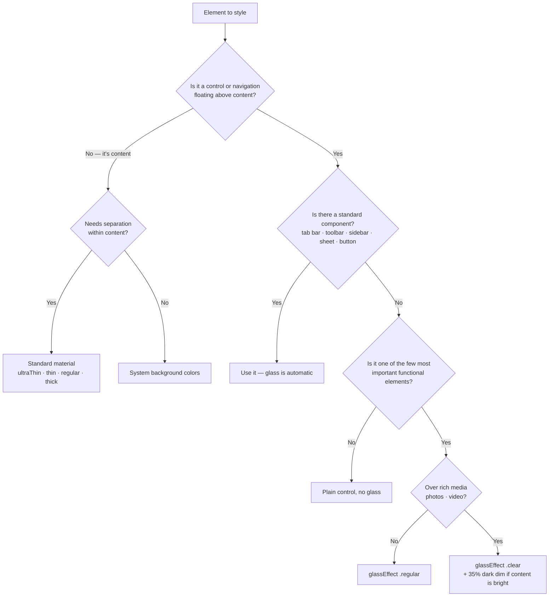

# Liquid Glass and materials

> Part of the **apple-design-language** skill — Created by Edison Augustin X.
> Source of truth: [`GUIDELINES.md` §4](../../../GUIDELINES.md#4-materials-and-liquid-glass) · Rules: [`rules/03-materials-liquid-glass.md`](../../../rules/03-materials-liquid-glass.md)
> Apple sources: [HIG › Materials](https://developer.apple.com/design/human-interface-guidelines/materials) · [Adopting Liquid Glass](https://developer.apple.com/documentation/technologyoverviews/adopting-liquid-glass) · [Applying Liquid Glass to custom views](https://developer.apple.com/documentation/swiftui/applying-liquid-glass-to-custom-views)

API names and signatures below were checked against Apple’s published declarations (September 2026). Snippets are illustrative and weren’t compiled in this repository — build them with the current Xcode.

## Contents
1. [Decide: glass, material, or nothing?](#1-decide-glass-material-or-nothing)
2. [Rules at a glance](#2-rules-at-a-glance)
3. [Adopt it for free with standard components](#3-adopt-it-for-free-with-standard-components)
4. [Custom glass (SwiftUI)](#4-custom-glass-swiftui)
5. [UIKit and AppKit equivalents](#5-uikit-and-appkit-equivalents)
6. [Scroll edge effects and background extension](#6-scroll-edge-effects-and-background-extension)
7. [Color on glass](#7-color-on-glass)
8. [Standard materials](#8-standard-materials)
9. [Platform notes](#9-platform-notes)
10. [Testing matrix](#10-testing-matrix)

---

## 1. Decide: glass, material, or nothing?



## 2. Rules at a glance

| Do | Don’t | Rule |
|---|---|---|
| Put controls and navigation in the glass layer | Put glass on backgrounds, cards, list rows | GLS-01 |
| Let standard components render glass | Sprinkle custom glass on many controls | GLS-02 |
| Keep standard spacing between glass elements | Stack glass on glass | GLS-03 |
| Remove custom bar/sheet/popover backgrounds | Set opaque bar appearances or `.toolbarBackground` colors | GLS-04 |
| Use `.regular` by default; `.clear` only over media | Use `.clear` over plain UI | GLS-05 |
| Test Reduce Transparency, Increase Contrast, Reduce Motion | Assume translucency is always visible | GLS-06 |
| One scroll edge effect per view, automatic style | Use scroll edge effects as decoration | GLS-07 |
| Group custom glass in `GlassEffectContainer` | Scatter many independent glass views | GLS-08 |
| Tint only the primary action’s background | Tint several controls | GLS-09 |

## 3. Adopt it for free with standard components

Building with the latest SDKs gives these components Liquid Glass automatically: navigation and tab bars, toolbars, sidebars, split views, sheets, popovers, menus, alerts, action sheets, and standard controls (`Button`, `Toggle`, `Slider`, `Stepper`, `Picker`, `TextField`). Slider and toggle knobs turn into glass while being dragged; buttons morph into menus and popovers.

**Remove** custom backgrounds that would fight the system (GLS-04):

| Framework | Check these for custom backgrounds |
|---|---|
| SwiftUI | `NavigationStack`, `NavigationSplitView`, `toolbar(content:)`, title bar |
| UIKit | `UINavigationBar`, `UITabBar`, `UIToolbar`, `UISplitViewController` |
| AppKit | `NSToolbar`, `NSSplitView` |

Temporary opt-out while migrating: the `UIDesignRequiresCompatibility` Info.plist key keeps the previous appearance when building with the latest SDK. Treat it as a stopgap.

## 4. Custom glass (SwiftUI)

All APIs in this section: iOS, iPadOS, macOS, tvOS, watchOS **26+** (not visionOS — visionOS windows use their own system glass).

### Button styles — prefer these over hand-built glass

```swift
Button("Add Item", systemImage: "plus") { add() }
    .buttonStyle(.glass)            // standard Liquid Glass button

Button("Done") { save() }
    .buttonStyle(.glassProminent)   // tinted with the accent color — one per view at most (CMP-01)
```

### `glassEffect(_:in:)`

Declaration: `func glassEffect(_ glass: Glass = .regular, in shape: some Shape = DefaultGlassEffectShape()) -> some View`. Default shape is a capsule behind the content. `Glass` provides `.regular`, `.clear`, `.identity`, and the modifiers `.tint(_:)` and `.interactive(_:)`.

```swift
// A floating custom control (functional layer only — GLS-01)
Label("Record", systemImage: "record.circle")
    .labelStyle(.iconOnly)
    .font(.title2)
    .padding()
    .glassEffect(.regular.interactive())   // reacts to touch and pointer like system buttons

// Larger component: use a rounded rectangle instead of the default capsule
MapControls()
    .padding()
    .glassEffect(in: .rect(cornerRadius: 16))

// Over a photo or video: clear variant (GLS-05). Add a dimming layer if the media is bright.
PlaybackOverlay()
    .glassEffect(.clear)
```

Apply `glassEffect` **after** other modifiers that change appearance — it captures the rendered content.

### Combine and morph with `GlassEffectContainer`

```swift
@Namespace private var glassNamespace
@State private var isExpanded = false

var body: some View {
    GlassEffectContainer(spacing: 20) {          // one container for related glass (GLS-08)
        HStack(spacing: 20) {
            Button("Draw", systemImage: "pencil.tip") { }
                .labelStyle(.iconOnly)
                .frame(width: 44, height: 44)     // ≥ 44 pt hit region (A11Y-01)
                .glassEffect(.regular.interactive())
                .glassEffectID("draw", in: glassNamespace)

            if isExpanded {
                Button("Erase", systemImage: "eraser") { }
                    .labelStyle(.iconOnly)
                    .frame(width: 44, height: 44)
                    .glassEffect(.regular.interactive())
                    .glassEffectID("erase", in: glassNamespace)
            }
        }
    }
    .animation(reduceMotion ? nil : .default, value: isExpanded)   // MOT-02
}
@Environment(\.accessibilityReduceMotion) private var reduceMotion
```

- Container `spacing` controls when neighboring shapes blend: larger spacing merges sooner. If the container spacing exceeds the inner stack spacing, shapes blend at rest.
- `glassEffectUnion(id:namespace:)` merges several views into one glass shape even when they aren’t adjacent.
- Transitions: `matchedGeometry` (default within container spacing) and `materialize` (for effects farther apart); set with `glassEffectTransition(_:)`.
- Performance: limit the number of containers and glass effects on screen at once.

## 5. UIKit and AppKit equivalents

| Need | UIKit | AppKit |
|---|---|---|
| Glass on a custom view | `UIGlassEffect` (in a `UIVisualEffectView`) | `NSGlassEffectView` |
| Glass buttons | `UIButton.Configuration.glass()`, `.prominentGlass()`, `.clearGlass()`, `.prominentClearGlass()` | `NSButton.BezelStyle.glass` |
| Scroll edge effect for a custom bar | `UIScrollEdgeElementContainerInteraction`, `UIScrollEdgeEffect.Style` | `NSScrollEdgeEffectStyle` |
| Background extension | `UIBackgroundExtensionView` | `NSBackgroundExtensionView` |
| Concentric corners | `UICornerConfiguration`, `cornerConfiguration` | — |
| Tab bar → sidebar | `UITabBarController.Mode.tabSidebar` | — |
| Minimize tab bar on scroll | `tabBarMinimizeBehavior = .onScrollDown` | — |
| Toolbar fixed space | `UIBarButtonItem.fixedSpace(_:)` | `NSToolbarItem.Identifier.space` |
| Action sheet origin | `sourceView` / `sourceItem` | `beginSheetModal(for:completionHandler:)` |

## 6. Scroll edge effects and background extension

- System bars apply a **scroll edge effect** automatically. For custom bars over scrolling content, register them (`safeAreaBar(...)` in SwiftUI, `UIScrollEdgeElementContainerInteraction` in UIKit).
- Style: `ScrollEdgeEffectStyle` — `.automatic` (preferred), `.hard`, `.soft`. Set with `.scrollEdgeEffectStyle(_:for:)`. Test `.soft` carefully for legibility (GLS-07).
- One effect per view; in split views, one per pane with matching heights.
- **Background extension:** `.backgroundExtensionEffect()` mirrors and blurs adjacent content under a sidebar or inspector — ideal for hero images in split views (LAY-09).

```swift
NavigationSplitView {
    Sidebar()
} detail: {
    ScrollView {
        HeroImage()
            .backgroundExtensionEffect()   // extends the image beneath the floating sidebar
        DetailContent()
    }
}
```

## 7. Color on glass

- Glass has no color of its own; it takes color from content behind it. Small bars flip between light and dark symbol colors automatically; large glass (sidebars) is more opaque for legibility.
- Tint the **background** of the single most important action (the system does this for prominent buttons like Done) — never several controls (GLS-09).
- Over colorful content, keep toolbars and tab bars monochrome, or pick an accent that clearly differs from content colors (COL-10).
- Supply light **and** dark variants for custom colors even if the app is single-appearance, so glass can adapt (COL-02).

## 8. Standard materials

For the content layer. iOS/iPadOS thicknesses: `ultraThin`, `thin`, `regular` (default), `thick` (SwiftUI `Material`, UIKit `UIBlurEffect`/`UIVisualEffectView`).

- Choose by purpose, not by apparent color (GLS-10).
- Use **vibrant** label, fill, and separator colors on materials; avoid quaternary label on thin/ultra-thin.
- Thicker = better contrast for fine text; thinner = more context visible.

## 9. Platform notes

| Platform | Notes |
|---|---|
| iOS | Tab bar floats at the bottom; can minimize on scroll with an accessory (`tabViewBottomAccessory`). Half sheets are inset and turn more opaque at full height. |
| iPadOS | Sidebars float in the glass layer; windows resize fluidly with rounder corners. |
| macOS | Toolbar in the window frame; `NSVisualEffectView` materials with behind-window or within-window blending. |
| tvOS | Glass on navigation and system experiences; buttons and image views become glass on focus (Apple TV 4K 2nd generation and later). Adopt standard focus APIs (`focusable(_:)`). |
| visionOS | Windows use unmodifiable system glass; keep it (GLS-11). Buttons on glass windows use the thin material; floating buttons use glass. |
| watchOS | Toolbar buttons adopt glass; adopt standard toolbar APIs and button styles. |

## 10. Testing matrix

Test every custom glass element in each state (GLS-06):

| Setting | What to verify |
|---|---|
| Light / Dark / Auto | Legibility at rest (top of scroll) and with bright/dark content underneath |
| Increase Contrast | Increased-contrast colors appear; borders and text remain distinct |
| Reduce Transparency | Glass becomes more opaque; nothing relies on see-through content |
| Reduce Motion | Morphs and transitions are reduced or become fades |
| User’s preferred Liquid Glass look | Appearance still reads correctly |
| Colorful content scrolling beneath | Controls stay legible; scroll edge effect engages |
| Dynamic Type AX5 | Glass shapes grow with content; nothing truncates |
