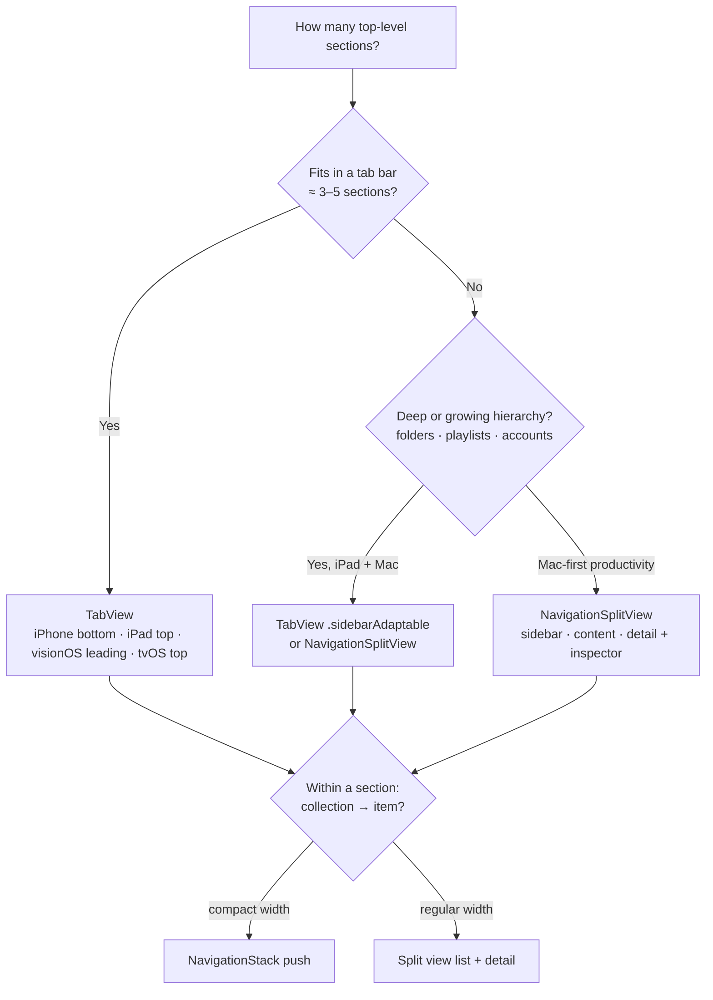

# Navigation: tab bars, sidebars, split views, toolbars, search

> Part of the **apple-design-language** skill — Created by Edison Augustin X.
> Source of truth: [`GUIDELINES.md` §13.2–§13.5](../../../GUIDELINES.md#13-components) · Rules: [`rules/10-navigation.md`](../../../rules/10-navigation.md)
> Apple sources: [Tab bars](https://developer.apple.com/design/human-interface-guidelines/tab-bars) · [Sidebars](https://developer.apple.com/design/human-interface-guidelines/sidebars) · [Split views](https://developer.apple.com/design/human-interface-guidelines/split-views) · [Toolbars](https://developer.apple.com/design/human-interface-guidelines/toolbars) · [Search fields](https://developer.apple.com/design/human-interface-guidelines/search-fields) · [Adopting Liquid Glass](https://developer.apple.com/documentation/technologyoverviews/adopting-liquid-glass)
> Implementations: [SwiftUI](swiftui-recipes.md) · [React](react-recipes.md#3-app-shell-tab-bar--sidebar) · [HTML + CSS](html-css-recipes.md) · [Tailwind](tailwind.md#3-app-shell-with-container-queries) · [Vue and Svelte](vue-svelte.md) · [Next.js](nextjs.md#2-app-shell-with-routing) · [React Native](react-native.md#4-navigation-native-tabs-and-stacks)

SwiftUI names were checked against Apple’s published declarations; snippets weren’t compiled here.

## Contents
1. [Choose the container](#1-choose-the-container)
2. [Tab bars](#2-tab-bars)
3. [Sidebars and split views](#3-sidebars-and-split-views)
4. [Toolbars](#4-toolbars)
5. [Search](#5-search)
6. [Hierarchical navigation and modality](#6-hierarchical-navigation-and-modality)
7. [Anti-patterns](#7-anti-patterns)

---

## 1. Choose the container



Rules: tab bars are for navigation only (NAV-01), always visible (NAV-02), never disabled (NAV-03), few and labeled (NAV-04). Use the platform container (NAV-06).

## 2. Tab bars

```swift
struct RootView: View {
    var body: some View {
        TabView {
            Tab("Library", systemImage: "books.vertical") { LibraryView() }   // one-word labels, filled
            Tab("For You", systemImage: "heart.text.square") { ForYouView() }  // symbols chosen by the system (NAV-04)
            Tab("Browse", systemImage: "square.grid.2x2") { BrowseView() }
            Tab(role: .search) { SearchView() }                                 // dedicated search tab, trailing end (NAV-16)
        }
        .tabViewStyle(.sidebarAdaptable)            // iPad: tab bar ⇄ sidebar; iPhone: tab bar
        .tabBarMinimizeBehavior(.onScrollDown)      // iOS 26+: optional; tab bar recedes while reading
    }
}
```

- `TabBarMinimizeBehavior`: `.automatic`, `.never`, `.onScrollDown`, `.onScrollUp`.
- `TabRole`: `.search` (separated at the trailing end), `.prominent`.
- iOS tab bar with an accessory (e.g., a mini player): `.tabViewBottomAccessory { … }` — it can move inline when the bar minimizes.
- iPad customization (`TabViewCustomization`): default to **five or fewer** tabs.
- Badges only for critical, new information (NAV-05).
- tvOS: 68 pt tall, 46 pt from the top (system-fixed). Live-viewing apps: live → recorded → other.
- visionOS: vertical on the window’s leading side; provide a symbol + short label for every tab.
- watchOS: no tab bars — use a list or vertical `TabView` pages.

## 3. Sidebars and split views

```swift
struct MailLikeView: View {
    @State private var selectedFolder: Folder.ID?
    @State private var selectedMessage: Message.ID?
    @State private var showInspector = false

    var body: some View {
        NavigationSplitView {
            List(folders, selection: $selectedFolder) { folder in
                Label(folder.name, systemImage: folder.symbol)          // SF Symbols in sidebars
            }
            .navigationTitle("Mailboxes")                               // concise, not the app name (NAV-10)
        } content: {
            MessageList(folder: selectedFolder, selection: $selectedMessage)
        } detail: {
            MessageDetail(id: selectedMessage)
                .inspector(isPresented: $showInspector) { MessageInfo(id: selectedMessage) }
        }
    }
}
```

- Sidebar: ≤ 2 levels, customizable, hideable with familiar interactions, **not hidden by default** (NAV-07).
- Extend rich imagery under the floating sidebar with `.backgroundExtensionEffect()` (LAY-09).
- Split view: persistently highlight the selection in each pane (NAV-08); iPhone uses split views only in regular width; iPad must work at narrow, compact, and intermediate widths.
- macOS: thin 1 pt dividers, sensible pane min/max sizes, hideable panes restorable by toolbar button **and** menu command with shortcut.
- visionOS: prefer a split view over opening another window for supplementary information.
- iPhone Duo: split views expand on the inner display and collapse to one pane on the outer display automatically.

## 4. Toolbars

```swift
.toolbar {
    ToolbarItem(placement: .cancellationAction) {
        Button("Cancel", role: .cancel) { dismiss() }              // leading on iOS (CMP-09)
    }
    ToolbarItemGroup(placement: .primaryAction) {                  // group related actions (NAV-12)
        Button("Share", systemImage: "square.and.arrow.up") { share() }
        Button("Duplicate", systemImage: "plus.square.on.square") { duplicate() }
    }
    ToolbarSpacer(.fixed)                                          // separates groups that share a background
    ToolbarItem(placement: .confirmationAction) {
        Button("Done") { save() }                                  // the single prominent action, trailing (NAV-11)
    }
}
```

- Standard **Back** and **Close** only — never buttons labeled “Back”/“Close” (NAV-09).
- Titles under 15 characters, never the app name (NAV-10); iOS large titles collapse on scroll (NAV-15).
- ≤ 3 groups; borderless system symbols; text only for actions like Edit; don’t mix text and icons in one group (NAV-12, NAV-13).
- Every icon needs an accessibility label — `Button(_:systemImage:action:)` and `Label` provide one automatically (A11Y-03).
- Don’t add a manual overflow menu on iPad/Mac; the system manages overflow (NAV-14).
- Hide a toolbar **item**, not the view inside it (`.hidden(_:)` on the item), to avoid empty glass capsules.
- macOS: every toolbar item also appears in the menu bar (PLT-MAC-02). visionOS: toolbar at the window bottom; no vertical toolbars or pull-down menus (PLT-VIS-05).
- iPhone Duo: give each item a title **and** symbol, set visibility priorities (`ToolbarItemVisibilityPriority`), and let the system overflow menu hold extras (PLT-DUO-05).

## 5. Search

```swift
NavigationStack {
    ResultsList(query: query)
        .searchable(text: $query, prompt: "Trips, places, people")   // informative placeholder (NAV-17)
}
```

| Platform | Placement (NAV-16) |
|---|---|
| iOS | Search **tab** (standard = discovery landing page; button appearance = quick search) · bottom toolbar when there’s room · top toolbar when bottom content must stay visible · inline above the list it filters |
| iPadOS / macOS | Trailing end of the toolbar · top of the sidebar to filter navigation · dedicated sidebar/tab item for discovery. Keep iPad and Mac consistent (SYNC-07). |
| tvOS | Search screen with suggestions |
| watchOS | Full-screen text input |

Behavior: search as people type, show recents/suggestions, most relevant first, scope bars defaulting to the broadest scope, tokens paired with suggestions (NAV-17). `searchToolbarBehavior(_:)` (26+) configures toolbar search behavior.

## 6. Hierarchical navigation and modality

- **Push** (`NavigationStack`) for drilling into content; supports the system back button and edge swipe.
- **Sheet** for a scoped task related to the current context; **full-screen cover** for immersive media or complex multistep editing; **popover** only in regular width (CMP-16).
- One modal at a time; always an obvious dismissal; confirm before discarding user content (CMP-07, CMP-08).

```swift
.sheet(isPresented: $isEditing) {
    NavigationStack {
        EditTripForm(trip: $draft)
            .navigationTitle("Edit Trip")
            .toolbar {
                ToolbarItem(placement: .cancellationAction) { Button("Cancel", role: .cancel) { attemptDismiss() } }
                ToolbarItem(placement: .confirmationAction) { Button("Done") { commit() } }
            }
    }
    .presentationDetents([.medium, .large])       // progressive disclosure on iPhone (CMP-10)
    .presentationDragIndicator(.visible)          // grabber for resizable sheets
    .interactiveDismissDisabled(draft.hasChanges) // then confirm with an action sheet (CMP-08)
}
```

## 7. Anti-patterns

| Anti-pattern | Why it’s wrong | Fix | Rule |
|---|---|---|---|
| “+” or “Compose” as a tab | Tabs navigate; actions belong in toolbars | Toolbar button | NAV-01 |
| Hiding the tab bar on detail screens | People lose their place | Keep it visible; only modals cover it | NAV-02 |
| Disabled tab while loading/empty | Unstable, unpredictable UI | Show the section with an empty state | NAV-03 |
| 7 tabs on iPhone → More tab | Hidden content | Fewer tabs, sidebar-adaptable on iPad | NAV-04 |
| Custom “‹ Back” text button | Breaks familiarity and RTL mirroring | System back button | NAV-09 |
| App name as every title | No orientation value | Describe the content | NAV-10 |
| Two tinted toolbar buttons | Competing focal points | One prominent trailing action | NAV-11, GLS-09 |
| Opaque colored navigation bar | Fights Liquid Glass and scroll edge effect | Remove custom background | GLS-04 |
| Device checks to pick tab bar vs sidebar | Breaks on resize/Duo/Mac | `sidebarAdaptable` + size classes | LAY-01 |
